# 🛡️ Cube Siege

<p align="center">
  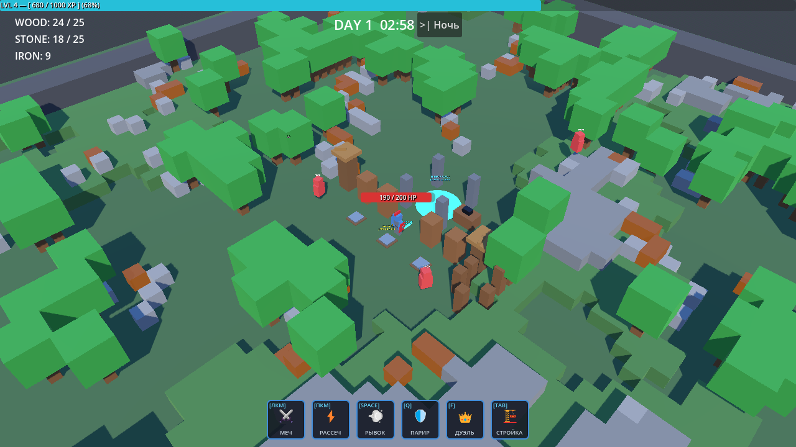
</p>

<p align="center">
  <strong>Изометрический Survival Roguelike / Extraction Wave Defense в стилистике воксельного 3D</strong>
</p>

<p align="center">
  
  
  
  
  
  
</p>

---

## 📖 О проекте

**Cube Siege** — динамичный изометрический экшен-рогалик с элементами защиты базы и эвакуации. Визуальный стиль вдохновлен блочной эстетикой *Minecraft Story Mode*, а игровой процесс сочетает глубину автобаттлеров и напряжение осадных стратегий (*Vampire Survivors* + *They Are Billions* + *Mindustry*).

> **Главная цель:**  
> Днём собирайте ресурсы, возводите стены, башни и ловушки, куйте экипировку на верстаке.  
> Ночью держите оборону против нарастающих волн монстров и боссов.  
> Почините древний **Портал Эвакуации**, удержите позицию 45 секунд и спасите своего героя в **Мета-Ростер** — или погибните от пермадеса, потеряв персонажа навсегда!

---

## 📸 Галерея экранов игры

### 1. Главное меню и Выбор классов
Интерфейс ростера героев позволяет управлять слотами персонажей, просматривать их текущий уровень, рекордные дни выживания и накопленный боевой опыт.

| Главное меню | Выбор героя из ростера |
|:---:|:---:|
| 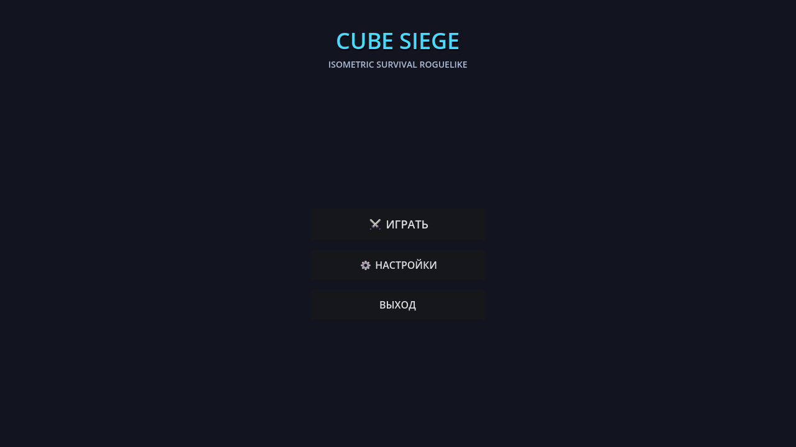 | 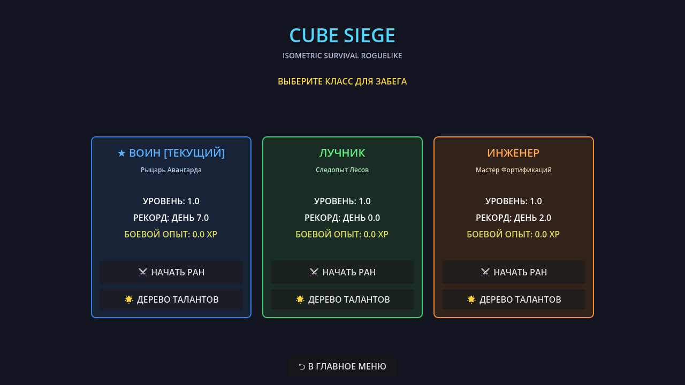 |
| *Главный экран игры с переходом в бой и настройки* | *Карточки персонажей: Воин, Лучник, Инженер* |

---

### 2. Дерево талантов и Мета-Мастерство
Глубокая постоянная мета-прогрессия для каждого класса. Заработанный в боях опыт трансформируется в очки мастерства (до 100 уровня).

<p align="center">
  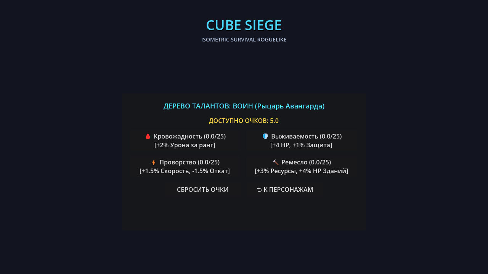
  <br />
  <em>Ветви мастерства: Кровожадность (+урон), Выживаемость (+HP/защита), Проворство (+скорость/кулдауны), Ремесло (+добыча/HP зданий)</em>
</p>

---

### 3. Фаза Дня: Исследование, Добыча и Оборона
Процедурно генерируемый мир с лесами, каменными валунами и залежами железной руды. Днем игрок исследует локацию, строит фортификации вокруг Портала Эвакуации и готовится к закату.

<p align="center">
  
  <br />
  <em>Изометрический вид: Воин возле портала, деревянные частоколы, лучковые вышки, напольные шипы и HUD ресурсов</em>
</p>

---

### 4. Строительство и Крафт экипировки
- **Радиальное меню строительства (Tab)**: мгновенный доступ к стенам, башням и ловушкам без остановки темпа игры.
- **Верстак экипировки**: создание оружия (+урон), латных доспехов (+HP, снижение урона) и сапог странника (+скорость бега и дальность рывка).

| Радиальное меню фортификаций | Верстак крафта и утилизации |
|:---:|:---:|
| 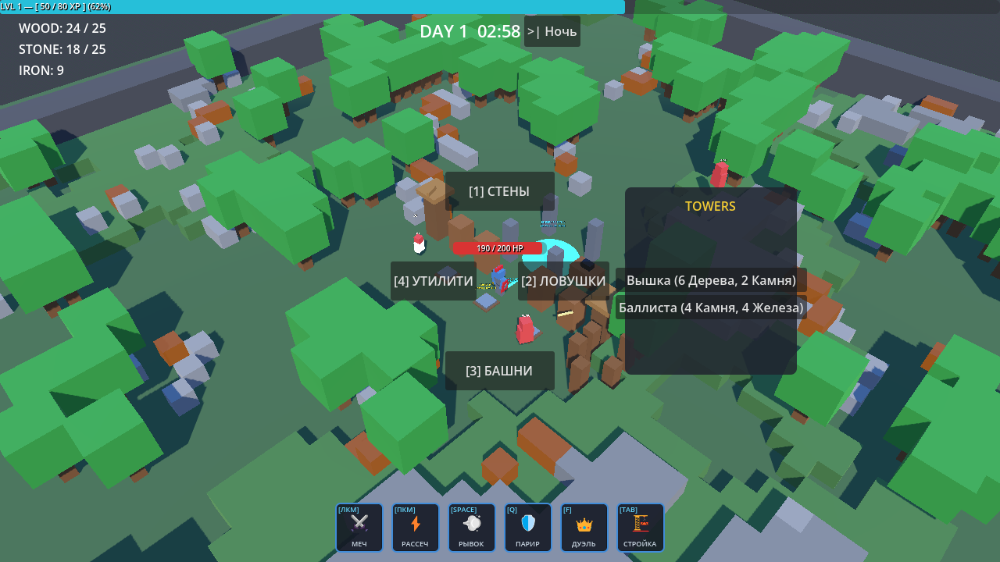 | 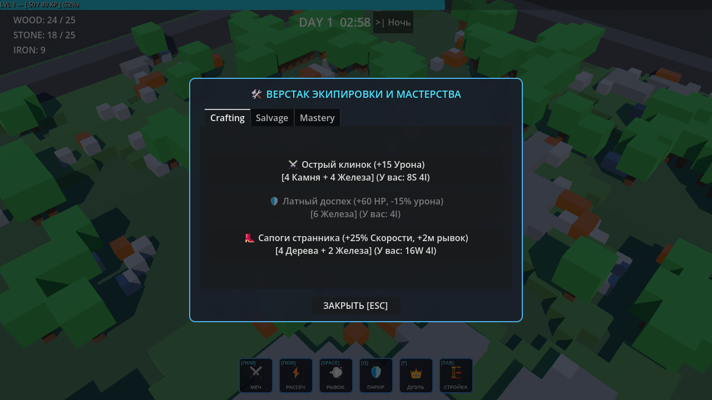 |
| *Двухуровневое радиальное меню строительства* | *Интерфейс создания экипировки и перков за ресурсы* |

---

### 5. Рогалик-драфт карт (Level-Up)
При каждом повышении уровня открывается драфт 3 случайных карт улучшений разной редкости. Комбинируйте синергии для создания уникальных билдов: вампиризм, баллистика вышек, жадный сбор ресурсов, криты и скорость.

<p align="center">
  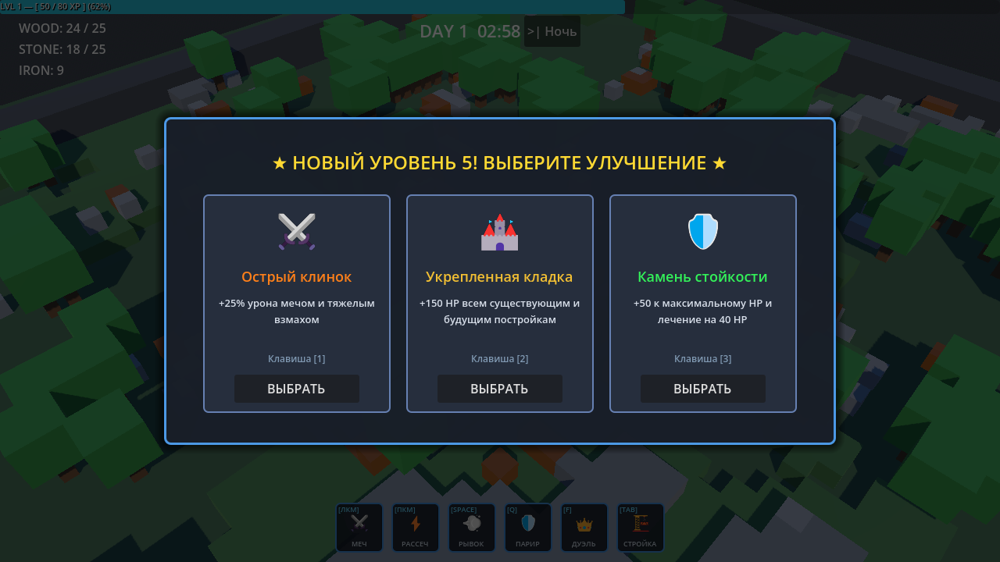
  <br />
  <em>Выбор одной из трех карт способностей при повышении уровня</em>
</p>

---

### 6. Фаза Ночи: Осада орд и Битва с Боссом
С наступлением ночи освещение сменяется холодным лунным светом, а режиссер волн направляет орды врагов на штурм базы по векторному полю (Flowfield). В кульминационные ночи пробуждаются колоссальные боссы — такие как **Gorgon the Trampler**!

<p align="center">
  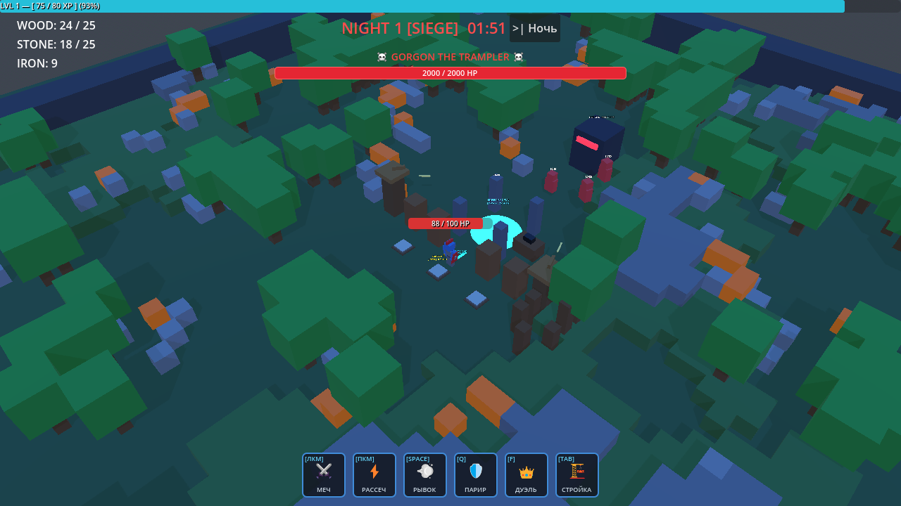
  <br />
  <em>Ночная осада: босс Gorgon the Trampler (2000 HP), наступающие враги и оборона базы</em>
</p>

---

### 7. Портал Эвакуации и Победа
Успешный ремонт портала (25 дерева + 25 камня) запускает 45-секундный финальный отсчет обороны периметра. Выживание гарантирует спасение героя в Мета-Ростер и щедрую награду очками мета-опыта.

<p align="center">
  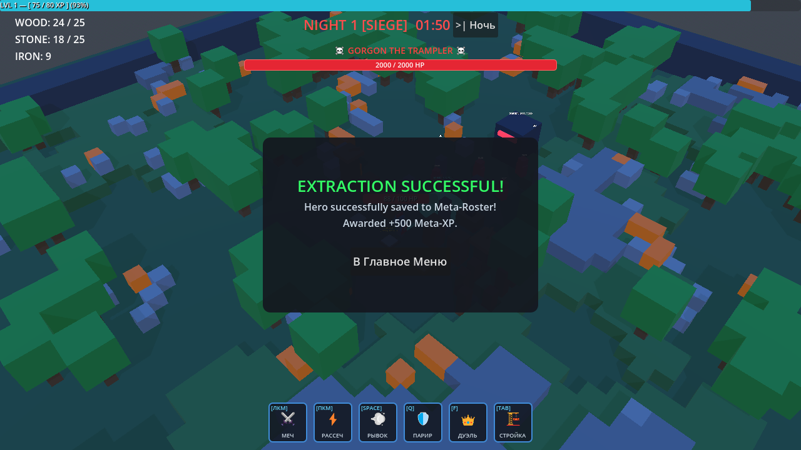
  <br />
  <em>Экран успешной эвакуации: сохранение прогресса и начисление Meta-XP</em>
</p>

---

## ⚔️ Классы героев

| Класс | Роль | Основное оружие | Особое умение | Ультимейт [F] |
|:---|:---|:---|:---|:---|
| **Воин (Warrior)** | Танк / Ближний бой | Меч (ЛКМ) | Рассекающий взмах (ПКМ) + Парирование щитом (Q) | **Дуэль чести**: привязывает босса/элитного врага световой цепью, блокируя его урон по базе |
| **Лучник (Archer)** | ДПС на дистанции | Композитный лук | Залп веером + Замедляющие ловушки | **Орлиный глаз**: увеличенный зум, бронебойные выстрелы сквозь строй врагов |
| **Инженер (Engineer)** | Контроль и оборона | Гаечный ключ / Дробовик | Переносная турель + Дистанционная мина | **Тесла-Купол**: шоковое поле, оглушающее и сжигающее всю толпу вокруг базы |

### Анимации Воина
<p align="center">
  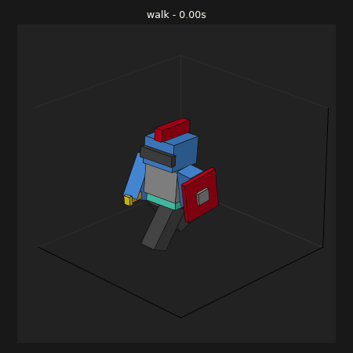
  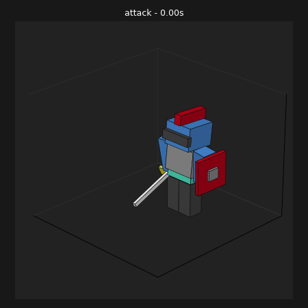
  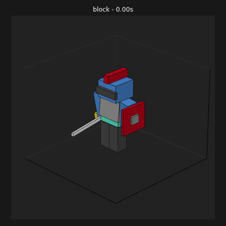
</p>

---

## 🏗️ Система построек

- **Деревянная стена**: базовое ограждение, останавливающее слабых врагов.
- **Железная укрепленная стена**: бронированная преграда с высоким запасом прочности.
- **Луковая вышка**: автоматический отстрел приближающихся целей.
- **Баллиста**: тяжелое дальнобойное орудие, прошивающее бронированных мобов.
- **Напольные шипы**: скрытая ловушка, наносящая периодический урон наступающим рядам.
- **Дистанционная мина**: детонирует по команде, расчищая скопления монстров.
- **Верстак**: точка взаимодействия для крафта улучшенной экипировки.

---

## 🎮 Управление

| Действие | Клавиша / Кнопка мыши |
|:---|:---|
| **Движение** | `W`, `A`, `S`, `D` |
| **Основная атака** | `ЛКМ` |
| **Особая атака** | `ПКМ` |
| **Рывок / Уворот** | `Пробел` |
| **Классовый навык (Парирование / Турель)** | `Q` |
| **Ультимативная способность** | `F` |
| **Меню строительства** | `Tab` |
| **Взаимодействие (Верстак / Портал)** | `E` |
| **Выбор карт в драфте** | `1`, `2`, `3` |
| **Пауза / Закрыть окно** | `Esc` |

---

## 💻 Технический стек и Архитектура

- **Движок**: [Godot 4.6.1](https://godotengine.org) (Forward+ Renderer / Vulkan 1.4).
- **Высокопроизводительное ядро C++**: реализовано через **GDExtension** (`src/player_controller.cpp`, `src/register_types.cpp`).
- **Алгоритм безопасной зоны (SafeZone)**: детекция замкнутого контура баз (Closed-Contour Polygon) для безопасного отдыха внутри периметра.
- **Навигация толпы (Crowd Pathfinding)**: 2D Flowfield на основе алгоритма Дейкстры (Dijkstra wavefront) для расчета маршрутов сотен мобов без просадок FPS.
- **Режиссер волн (Wave Director)**: кольцевой спавн мобов с адаптивной сложностью и дросселированием спавна во время битв с боссами.
- **3D Модели**: воксельные low-poly меши, экспортированные из Blockbench (`.bbmodel`).

### Структура проекта
```text
├── assets/                 # 3D модели, анимации и превью
│   └── models/characters/  # Модели героев, текстуры, Blockbench исходники
├── bin/                    # Скомпилированные библиотеки GDExtension (.dll, .gdextension)
├── docs/                   # Полная дизайн- и тех-документация
│   ├── ARCHITECTURE.md     # Техническая архитектура и алгоритмы
│   ├── BACKLOG.md          # 5 спринтов разработки
│   ├── GDD.md              # Подробный Game Design Document (v1.2.0)
│   ├── SCHEMAS/            # JSON-схемы сущностей
│   └── screenshots/        # Скриншоты экранов игры
├── godot-cpp/              # Git-субмодуль с C++ биндингами Godot
├── scenes/                 # Сцены уровней, UI, врагов и префабов
├── scripts/                # Игровая логика на GDScript
├── src/                    # Исходный код C++ (GDExtension)
├── project.godot           # Конфигурация проекта Godot 4
└── SConstruct              # Скрипт сборки C++ через SCons
```

---

## 🚀 Установка и Запуск

### Предварительные требования
1. **Godot Engine 4.6+**: скачайте [Godot Engine](https://godotengine.org/download).
2. **Компилятор C++**: Visual Studio 2022 (MSVC) или MinGW-w64 / GCC / Clang.
3. **Python 3.10+** и **SCons**: для сборки GDExtension.

### Инструкция по сборке

1. **Клонируйте репозиторий с субмодулями**:
   ```bash
   git clone --recursive https://github.com/alex123321-maker/Cube-Siege.git
   cd Cube-Siege
   ```

2. **Соберите C++ модуль (GDExtension)**:
   ```bash
   scons platform=windows target=template_debug -j4
   ```

3. **Запустите проект в Godot**:
   - Откройте Godot Engine.
   - Нажмите **Импортировать** (Import) и выберите файл `project.godot`.
   - Запустите проект клавишей **F5**.

---

## 📚 Документация проекта

Подробные спецификации и технические детали доступны в директории `docs/`:
- 📄 [**Game Design Document (GDD)**](docs/GDD.md) — полный геймдизайн-документ (баланс, формулы урона, экономика, бестиарий).
- ⚙️ [**Technical Architecture**](docs/ARCHITECTURE.md) — детальный разбор C++ ядра, SafeZone, Flowfield и пайплайна сохранений.
- 📋 [**Development Backlog**](docs/BACKLOG.md) — дорожная карта проекта на 5 спринтов.

---

## 📜 Лицензия

Проект распространяется под лицензией [MIT](LICENSE).
Приятной игры и удачной эвакуации! 🏰⚔️
