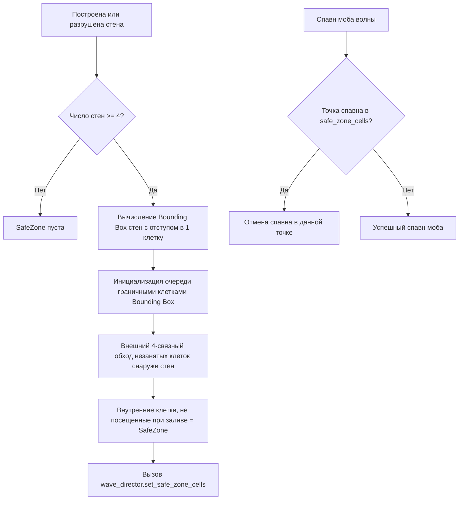

# Technical Architecture Document (TDD): Project "Cube Siege"

> **Статус**: Архитектурная спецификация (Обновлено по результатам технического аудита)  
> **Роль**: Lead Technical Architect & Systems Engineer  
> **Версия**: 1.3.0  
> **Стек (Текущий)**: Godot Engine 4.6 + GDScript Core + EventBus + Base Class Hierarchy  
> **Стек (Целевой / Масштабирование)**: C++ (GDExtension) для Swarm/Flowfield + GDScript UI  

---

## 1. Архитектурный стиль и технологический стек

### 1.1. Текущая архитектура (GDScript Core + Event Bus)
- **Игровой движок**: Godot Engine 4.x (4.6 Forward Plus).
- **Слабая связанность через `EventBus`** (`scripts/event_bus.gd`):
  Центральный узел сигналов для взаимодействия систем без прямых циклических ссылок:
  - `resources_changed`, `building_placed`, `building_destroyed`
  - `day_started`, `night_started`, `cycle_time_updated`, `wave_started`, `wave_cleared`
  - `player_health_changed`, `player_xp_changed`, `player_level_up`, `player_class_changed`, `player_died`
  - `portal_repair_started`, `portal_repair_complete`, `portal_evacuation_started`, `portal_evacuated`
  - `boss_spawned`, `boss_defeated`
  - `workbench_opened` (открытие модального окна верстака без прямого поиска HUD)
- **Иерархия базовых классов**:
  - `EnemyBase` (`scripts/enemy_base.gd`): общий базовый класс для рядовых врагов (`enemy_dummy.gd`), стрелков (`ranged_skirmisher.gd`) и таранщиков (`siege_breaker.gd`), объединяющий механику урона, шагового подъема (Voxel Step-Up), гравитации и дуэлей.
  - `TowerTargeting` (`scripts/tower_targeting.gd`): централизованная утилита поиска ближайших целей без дублирования кода.
- **Отказоустойчивость сохранений**: `SaveManager` версионирован (`SAVE_VERSION = 2`) с валидацией целостности данных при загрузке.

### 1.2. Целевой стек для оптимизации (C++ GDExtension / Roadmap)
- Для поддержки 500+ одновременных юнитов на поздних этапах запланирован перенос ресурсоемких систем в C++:
  1. *2D Flowfield Pathfinding*: вычисление волнового фронта Дейкстры на стороне нативного кода.
  2. *Swarm Simulation*: пакетная обработка физики толпы и рендеринг через MultiMeshInstance3D.
  3. *Bullet Hell / Projectiles*: пулинг и расчет траекторий сотен снарядов.

---

## 2. Ключевые алгоритмы и технические подсистемы

### 2.1. Алгоритм замкнутого контура баз (SafeZone Flood-Fill)
Для предотвращения появления противников внутри базы используется алгоритм внешнего залива (Flood-Fill) на дискретной сетке ($1 \times 1$ метр) в `scripts/safe_zone_detector.gd`:

1. **Дискретизация**: Сетка $1 \times 1$ метр по координатам стен `Vector2i(cell.x, cell.y)`.
2. **Связность**: Только 4 ортогональных направления (N, S, E, W). Диагональные зазоры считаются проницаемыми для залива.
3. **Реакция WaveDirector**: Если рассчитанная координата спавна попадает в словарь `safe_zone_cells`, спавн отклоняется (`return`). В коде нет механизма разрушения стен при спавне или урона игроку вне зоны.

### 2.2. Система поиска пути (Pathfinding: Current vs Planned)

* **Текущая реализация (CURRENT)**:
  - В `scripts/enemy_base.gd` враги вычисляют вектор движения напрямую к активной цели (игроку или порталу): `(target.global_position - global_position).normalized()`.
  - Преодоление мелких неровностей ландшафта реализовано через трассировку воксельных лучей и подъем (Voxel Step-Up).
* **Целевая архитектура (TARGET / PLANNED — Milestone 5)**:
  - Для управления 500+ мобами без индивидуальных вызовов поиска пути запланирован перенос навигации в C++ GDExtension на базе 2D Flowfield (поле течений).
  - Интеграционное поле (волновой фронт Дейкстры) рассчитывается 1 раз за фиксированный интервал от позиции базы/игрока.
  - Каждая клетка сетки содержит вектор направления; мобы считывают скорость за $O(1)$.
  - Осадные мобы (`siege_breaker.gd`) получают дополнительную карту весов для притяжения к постройкам стен.

### 2.3. Режиссер волн (Wave Director: Фактическая реализация)
Реализован в `scripts/wave_director.gd`:
- **Интервал спавна**: фиксированный таймер `spawn_interval = 1.6` сек во время ночной фазы.
- **Кольцевой спавн**: точка спавна выбирается на случайном угле вокруг игрока на радиусе `randf_range(20.0, 28.0)` метров с ограничением по границам арены `[-36.0, 36.0]`.
- **Лимиты одновременных врагов**:
  - При обычной волне: максимум `max_concurrent_enemies = 20`.
  - При активном боссе (группа `"boss"`): действует ограничение `effective_max = 4` моба свиты.
- **Распределение архетипов**:
  - Волна 1: 75% `EnemyDummy` (ближний бой), 25% `RangedSkirmisher` (стрелок).
  - Волна > 1: 50% `EnemyDummy`, 25% `RangedSkirmisher`, 25% `SiegeBreaker` (таранщик стен).
- *Примечание по GDD*: запланированное в дизайн-документе расписание волн 10/20/30 и динамическое масштабирование пула свиты в коде `wave_director.gd` пока отсутствуют (босс вызывается отдельно).

### 2.4. Боевой пайплайн и Ультимейты [F]
Реализован через декомпозированные подсистемы `PlayerCombat` (`scripts/player/player_combat.gd`) и `PlayerAbilities` (`scripts/player/player_abilities.gd`):
- **Векторный прицел**: Проекция луча из камеры в плоскость $Y=0$ (`Plane(Vector3.UP, 0.0)`). Поддерживается альтернативное twin-stick прицеливание стрелками клавиатуры (`PlayerAim`).
- **Базовые и специальные атаки (`PlayerCombat`)**:
  - Воин: взмахи мечом (`trigger_slash`) с расчётом сектора поражения (Hitbox/Arc), круговой спецвзмах на 180° с повышенным отбросом.
  - Лучник: выпуск стрелы (`trigger_arrow_shot`) и пробивающая стрела (`trigger_piercing_arrow`, сквозь до 6 целей).
  - Инженер: удар молотом (`trigger_hammer_smash`) с автоматическим ремонтом построек в радиусе 2.8м и установка временных турелей.
- **Утилиты и Ультимейты (`PlayerAbilities`)**:
  - **Парирование Воина [Q]**: Окно неуязвимости ровно 0.5с с кулдауном 6.0с (в координации с `PlayerHealth`).
  - **Приманка Лучника**: установка голографического чучела (`scenes/prefabs/decoy_dummy.tscn`) для отвлечения мобов.
  - **Дистанционная мина Инженера**: закладка и детонация взрывчатки (`scenes/prefabs/remote_mine.tscn`).
  - **Ультимейт Воина («Дуэль чести»)**: Связка `DuelLink(Warrior, TargetEnemy)` через сцену `scenes/duel_tether.tscn`, принудительное автоприцеливание на цель дуэли, +20% наносимого урона.
  - **Ультимейт Лучника («Око Снайпера / Eagle Eye»)**: Отдаление камеры до `camera.size = 34.0` через tween (0.5с) для тактического обзора арены.
  - **Ультимейт Инженера («Тактический ядерный удар / Tactical Nuke»)**: AoE радиус 10м с визуальным телеграфом 1.2с, нанесение 300 единиц взрывного урона и мощный отброс врагов с кулдауном 60с.
- **Карты усилений**: Мутации характеристик и построек (`apply_card_upgrade`) изолированы в `PlayerAbilities` и обращаются к `BuildingSystem` через типизированный контракт.

### 2.5. Процедурный мир, биомы и вертикальная боевая система
Архитектура процедурного мира и вертикального боя декомпозирована на специализированные модули:
- **`BiomeSystem` (`scripts/world/biome_system.gd`)**:
  - Строго детерминированная процедурная генерация по мировым координатам $(x, z)$ и сиду мира.
  - 3 макро-сектора вокруг Портала (радиус клиринга 6.5м): Лес (0..+10 блоков, пологие холмы), Равнина (0..+4 блока, открытые пространства), Горы (масштабирование высоты от расстояния до 50+ и 100+ в глубине сектора).
  - Сглаживание границ секторов: кубическое эрмитово затухание `edge_attenuation` гарантирует плавное схождение горного массива к уровню соседних секторов; стохастический дизеринг материалов и блендинг вероятностей ресурсов обеспечивают органичный переход между биомами.
  - Авторитетная тропа в горах (`is_mountain_trail`): непрерывный коридор шириной 2.4м со строгим уклоном ступеней `|Δheight| <= 1` от Портала (0м) до высот 50+ и 100+ без размещения непроходимых полнотелых месторождений.
  - Правило ступеней: перепад высоты `|Δheight| <= 1` воксельный блок — проходим; перепад `|Δheight| >= 2` — непроходимая стена/обрыв.
- **`ResourceDistribution` (`scripts/world/resource_distribution.gd`)**:
  - Авторитетные матрицы весов ресурсов по биомам и высотам:
    - **Лес**: 85% Дерево / 14% Камень / 1% Железо / 0% Магический камень / 0% Пусто.
    - **Равнина**: 20% Дерево / 10% Камень / 0% Железо / 2% Магический камень / 68% Пусто (декоративная трава).
    - **Низкие горы (< 50)**: 80% Камень / 5% Дерево / 3% Железо / 0% Магический камень / 12% Пусто.
    - **Высокие горы (>= 50)**: 80% Камень / 2% Дерево / 15% Железо / 0% Магический камень / 3% Пусто.
  - Разделение на **Свободные пикапы** (`FreeResourcePickup`, слой коллизий 4 (bit 3: 8), 1-3 ед., сбор через [E] без боя, не блокируют перемещение) и **Полнотелые месторождения** (`ResourceTree`, `ResourceRock`, слой коллизий 1, разрушаемые атаками).
  - Магический камень существует исключительно в виде свободных пикапов (1-3 ед.) и является ран-ресурсом, отображаемым в HUD и сохраняемым в `ResourceWallet`.
  - Вариативность: дубы (0-4 вариации, в горах только молодые деревья и кустарники), тиры камня и железа (Small/Medium/Large) с визуальными стадиями разрушения при 66% и 33% HP.
  - Прозрачность листвы: `CameraFollow` отслеживает перекрытие игрока кронами деревьев через сенсор `CanopyOcclusion` и переводит листву в полупрозрачный режим.

- **`TerrainCombatRules` (`scripts/combat/terrain_combat_rules.gd`)**:
  - Ближний бой: прямое попадание при `|Δy| <= 1.0`, распространение удара по непрерывным лестницам (каждый шаг `|Δy| <= 1.0`), блокировка при разрыве `>= 2.0` блоков.
  - Режимы способностей: `TERRAIN_DEPENDENT` (взмахи Воина, стрелы Лучника) требуют связности по высоте; `TERRAIN_INDEPENDENT` (Тактический ядерный удар Инженера) рассчитывает попадание по горизонтальному радиусу на 3D-поверхности рельефа независимо от перепада высоты.
  - Снаряды: подъем на +1 блок по склону, спуск на -1 блок, столкновение со стеной при подъеме `>= +2`, полет по прямой без пикирования в пропасть при обрыве `>= 2` блоков.
- **`ChunkBuilder` (`scripts/world/chunk_builder.gd`) и `MapGenerator` (`scripts/map_generator.gd`)**:
  - Чанковый стриминг: размер чанка 16x16 вокселей, радиус загрузки 3 чанка (~96м), радиус выгрузки 5 чанков (гистерезис выгрузки для предотвращения трэшинга на границе видимости).
  - Единый `ArrayMesh` с 4 поверхностными проходами (Лес, Равнина, Горы, Скалы) и `ConcavePolygonShape3D` на чанк: минимальный оверхед по узлам (49 StaticBody3D в начальной области 7x7 при `load_radius=3`; с учётом гистерезиса выгрузки `unload_radius=5` рабочий набор при движении динамически ограничен 77–121 чанками, сохраняя O(1) профиль памяти).
  - Персистентный трекинг сбора: словарь `harvested_cells` в `MapGenerator` сохраняет координаты добытых ресурсов, исключая их повторный спавн при выгрузке и повторной загрузке чанка.

---

## 3. Схема сохранения и персистентность (Consolidated Persistence)

Сохранение состояния полностью консолидировано под единым синглтоном `SaveManager` (`scripts/save_manager.gd`) с версионированной схемой данных (`SAVE_VERSION = 2`):

| Компонент | Роль в системе | Хранимые секции | Фактический файл |
| :--- | :--- | :--- | :--- |
| **SaveManager** (`scripts/save_manager.gd`) | Авторитетный фасад персистентности, валидация JSON, миграция со схемы v1 и сайдкаров. | `meta_xp`, `survived_runs`, `unlocked_classes`, `roster_slots`, `mastery`, `run_history` | `user://cube_siege_save.json` |
| **RosterManager** (`scripts/roster_manager.gd`) | Доменный фасад управления персонажами, слотами классов и опытом забегов. | Делегирует в `SaveManager.save_data.roster_slots` | Единое хранилище `SaveManager` |
| **MasteryManager** (`scripts/mastery_manager.gd`) | Доменный фасад глобального дерева талантов и мета-очков. | Делегирует в `SaveManager.save_data.mastery` | Единое хранилище `SaveManager` |

* **Автоматическая миграция**: При обнаружении старых файлов `user://character_roster.json` или `user://mastery_save.json` данные автоматически импортируются в схему v2 `SaveManager`, предотвращая потерю прогресса игроков.
* **Изоляция в тестах**: Экспортное свойство `@export var auto_load: bool = true` позволяет тестовым экземплярам запускаться без побочных эффектов чтения реального файла пользователя.

---

## 4. Декомпозиция подсистем и реестры сущностей

### 4.1. Архитектура игрока (Player Subsystem Composition)
Монолитный `player_prototype.gd` декомпозирован на 8 специализированных подсистем при сохранении полного публичного API и отсутствии глобального `find_child` поиска зависимостей:
- `PlayerMovement` (`scripts/player/player_movement.gd`): расчет перемещения, изометрия, рывок уклонения и физика столкновений.
- `PlayerAim` (`scripts/player/player_aim.gd`): прицеливание через плоскость камеры и twin-stick клавиши.
- `PlayerHealth` (`scripts/player/player_health.gd`): обработка урона, окно парирования щитом [Q] и эмит смерти.
- `PlayerProgression` (`scripts/player/player_progression.gd`): прокачка XP, уровни, масштабирование характеристик и вампиризм.
- `PlayerInteraction` (`scripts/player/player_interaction.gd`): сбор кандидатов в радиусе 4.5м, выбор лучшего кандидата и удержание клавиши [E].
- `PlayerPresentation` (`scripts/player/player_presentation.gd`): координация анимаций Blockbench, стрелка компаса портала и плавающие числа.
- `PlayerCombat` (`scripts/player/player_combat.gd`): таймеры и диспетчеризация базовых/специальных атак, расчёт комбат-сеток, взмахи оружием и спавн стрел/снарядов.
- `PlayerAbilities` (`scripts/player/player_abilities.gd`): классовые утилиты (парирование, манекен, мина, турель), ультимейты (дуэль, eagle eye, ядерный удар) и мутации улучшений карт.
- `InteractableTarget` (`scripts/interaction/interactable_target.gd`): строго типизированный интерфейсный контракт взаимодействия (`HARVEST`, `REPAIR`, `DEMOLISH`, `PORTAL_REPAIR`, `PORTAL_EVACUATE`, `WORKBENCH`) с прямым полиморфным dispatch по типам классов (`Workbench`, `BuildingBase`, `PortalController`, `ResourceTree`, `ResourceRock`, `RelicPedestal`).

### 4.2. Реестр сущностей (EntityRegistry & EventBus)
- **EntityRegistry** (`scripts/core/entity_registry.gd`): отслеживает активные постройки, врагов и боссов. Автоматически синхронизируется с событиями `EventBus` (`building_placed`, `building_destroyed`, `boss_spawned`, `boss_defeated`, `enemy_killed`).
- **Оптимизация SiegeBreaker**: вместо сканирования сцены каждый кадр таранщик опрашивает `EntityRegistry` с интервалом ретаргетинга 0.8с с кэшированием квадрата расстояния.
- **WaveDirector**: проверка лимита врагов и присутствия боссов за $O(1)$ через `EntityRegistry`.
- **GDExtension Boundary**: нативный класс `NativeProbe` (`src/native_probe.cpp`) поддерживает сборку C++ и проверку `is_native_loaded()` в CI.

### 4.3. Разделение UI и предметной области (UI / Domain Separation)
- **Отсутствие обратной связи Domain -> UI**: Игровые компоненты (`DayNightCycle`, `PortalController`, `BuildingSystem`) не производят поиск UI-узлов (`HUD`, `Control`) через SceneTree и не мутируют состояние интерфейса напрямую.
- **Самостоятельный рендеринг HUD**: `HUD` (`scripts/hud.gd`) подписан на `EventBus.cycle_time_updated` (или локальный сигнал `DayNightCycle.time_updated` в тестах) и самостоятельно управляет форматированием и палитрой `DayNightLabel`.
- **Явные зависимости UI**: Интерактивные элементы управления (например, `BtnSkipNight` в `scripts/hud.gd` и `WorkbenchModal` в `scripts/workbench_modal.gd`) используют предварительно разрешённые типизированные зависимости (`day_night_cycle: DayNightCycle`, `building_system: BuildingSystem`) вместо глобального discovery (`root.find_child`).
- **События завершения ран-сессии**: `PortalController` публикует событие `EventBus.portal_evacuated(day_number, earned_xp)`, на которое подписан корневой координатор `Main` (`scripts/main.gd`) для вызова `show_victory()`.

