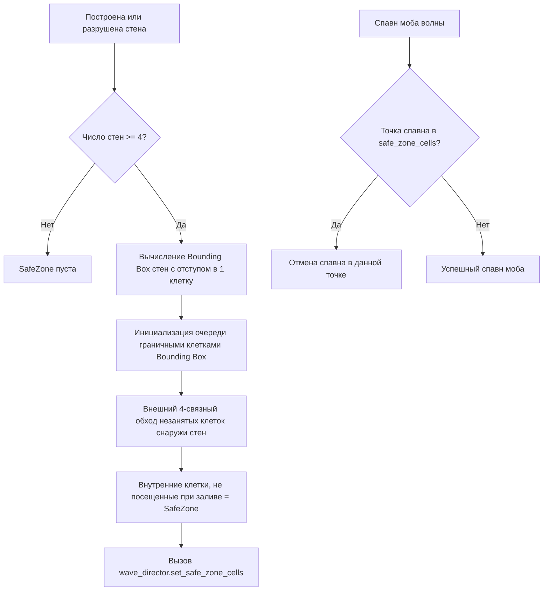

# Technical Architecture Document (TDD): Project "Cube Siege"

> **Статус**: Архитектурная спецификация (Обновлено по результатам технического аудита)  
> **Роль**: Lead Technical Architect & Systems Engineer  
> **Версия**: 1.3.0  
> **Стек (Текущий)**: Godot Engine 4.6 + GDScript Core + EventBus + Base Class Hierarchy  
> **Стек (Целевой / Масштабирование)**: C++ (GDExtension) для Swarm/Flowfield + GDScript UI  

---

## 1. Архитектурный стиль и технологический стек

### 1.1. Текущая архитектура (GDScript Core + Event Bus)
- **Игровой движок**: Godot Engine 4.x (4.6 Forward Plus).
- **Слабая связанность через `EventBus`** (`scripts/event_bus.gd`):
  Центральный узел сигналов для взаимодействия систем без прямых циклических ссылок:
  - `resources_changed`, `building_placed`, `building_destroyed`
  - `day_started`, `night_started`, `wave_started`, `wave_cleared`
  - `player_health_changed`, `player_xp_changed`, `player_level_up`, `player_class_changed`, `player_died`
  - `boss_spawned`, `boss_defeated`
- **Иерархия базовых классов**:
  - `EnemyBase` (`scripts/enemy_base.gd`): общий базовый класс для рядовых врагов (`enemy_dummy.gd`), стрелков (`ranged_skirmisher.gd`) и таранщиков (`siege_breaker.gd`), объединяющий механику урона, шагового подъема (Voxel Step-Up), гравитации и дуэлей.
  - `TowerTargeting` (`scripts/tower_targeting.gd`): централизованная утилита поиска ближайших целей без дублирования кода.
- **Отказоустойчивость сохранений**: `SaveManager` версионирован (`SAVE_VERSION = 1`) с валидацией целостности данных при загрузке.

### 1.2. Целевой стек для оптимизации (C++ GDExtension / Roadmap)
- Для поддержки 500+ одновременных юнитов на поздних этапах запланирован перенос ресурсоемких систем в C++:
  1. *2D Flowfield Pathfinding*: вычисление волнового фронта Дейкстры на стороне нативного кода.
  2. *Swarm Simulation*: пакетная обработка физики толпы и рендеринг через MultiMeshInstance3D.
  3. *Bullet Hell / Projectiles*: пулинг и расчет траекторий сотен снарядов.

---

## 2. Ключевые алгоритмы и технические подсистемы

### 2.1. Алгоритм замкнутого контура баз (SafeZone Flood-Fill)
Для предотвращения появления противников внутри базы используется алгоритм внешнего залива (Flood-Fill) на дискретной сетке ($1 \times 1$ метр) в `scripts/safe_zone_detector.gd`:

1. **Дискретизация**: Сетка $1 \times 1$ метр по координатам стен `Vector2i(cell.x, cell.y)`.
2. **Связность**: Только 4 ортогональных направления (N, S, E, W). Диагональные зазоры считаются проницаемыми для залива.
3. **Реакция WaveDirector**: Если рассчитанная координата спавна попадает в словарь `safe_zone_cells`, спавн отклоняется (`return`). В коде нет механизма разрушения стен при спавне или урона игроку вне зоны.

### 2.2. Система поиска пути (Pathfinding: Current vs Planned)

* **Текущая реализация (CURRENT)**:
  - В `scripts/enemy_base.gd` враги вычисляют вектор движения напрямую к активной цели (игроку или порталу): `(target.global_position - global_position).normalized()`.
  - Преодоление мелких неровностей ландшафта реализовано через трассировку воксельных лучей и подъем (Voxel Step-Up).
* **Целевая архитектура (TARGET / PLANNED — Milestone 5)**:
  - Для управления 500+ мобами без индивидуальных вызовов поиска пути запланирован перенос навигации в C++ GDExtension на базе 2D Flowfield (поле течений).
  - Интеграционное поле (волновой фронт Дейкстры) рассчитывается 1 раз за фиксированный интервал от позиции базы/игрока.
  - Каждая клетка сетки содержит вектор направления; мобы считывают скорость за $O(1)$.
  - Осадные мобы (`siege_breaker.gd`) получают дополнительную карту весов для притяжения к постройкам стен.

### 2.3. Режиссер волн (Wave Director: Фактическая реализация)
Реализован в `scripts/wave_director.gd`:
- **Интервал спавна**: фиксированный таймер `spawn_interval = 1.6` сек во время ночной фазы.
- **Кольцевой спавн**: точка спавна выбирается на случайном угле вокруг игрока на радиусе `randf_range(20.0, 28.0)` метров с ограничением по границам арены `[-36.0, 36.0]`.
- **Лимиты одновременных врагов**:
  - При обычной волне: максимум `max_concurrent_enemies = 20`.
  - При активном боссе (группа `"boss"`): действует ограничение `effective_max = 4` моба свиты.
- **Распределение архетипов**:
  - Волна 1: 75% `EnemyDummy` (ближний бой), 25% `RangedSkirmisher` (стрелок).
  - Волна > 1: 50% `EnemyDummy`, 25% `RangedSkirmisher`, 25% `SiegeBreaker` (таранщик стен).
- *Примечание по GDD*: запланированное в дизайн-документе расписание волн 10/20/30 и динамическое масштабирование пула свиты в коде `wave_director.gd` пока отсутствуют (босс вызывается отдельно).

### 2.4. Боевой пайплайн и Ультимейты [F]
- **Векторный прицел**: Проекция луча из камеры в плоскость $Y=0$ (`Plane(Vector3.UP, 0.0)`). Поддерживается альтернативное прицеливание стрелками клавиатуры.
- **Парирование Воина [Q]**: Окно неуязвимости ровно 0.5с с кулдауном 6.0с (`scripts/player_prototype.gd`).
- **Ультимейт Воина («Дуэль чести»)**:
  - Связка `DuelLink(Warrior, TargetEnemy)` через сцену `scenes/duel_tether.tscn`.
  - Принудительное автоприцеливание на цель дуэли, +20% наносимого урона.
- **Ультимейт Лучника («Око Снайпера / Eagle Eye»)**:
  - Отдаление камеры до `camera.size = 34.0` через tween (0.5с) для тактического обзора арены.
  - *Tech Debt*: флаг `is_eagle_eye` устанавливается, но модификатор дальности стрельбы стрелами в текущем коде не применён.
- **Ультимейт Инженера («Тактический ядерный удар / Tactical Nuke»)**:
  - AoE радиус 10м с визуальным телеграфом 1.2с, нанесение 300 единиц взрывного урона и мощный отброс врагов с кулдауном 60с.

---

## 3. Схема сохранения и Архитектурный долг (Persistence Tech Debt)

> [!WARNING]
> **CURRENT TECH DEBT: Тройное дублирование владения сохранениями**  
> В текущей кодовой базе сохранение состояния распределено между тремя независимыми менеджерами, пишущими в три разных JSON-файла:

| Менеджер | Файл сохранения | Хранимые данные | Поведение при поражении / победе |
| :--- | :--- | :--- | :--- |
| **SaveManager** (`scripts/save_manager.gd`) | `user://cube_siege_save.json` | `meta_xp`, `survived_runs`, `heroes_roster`, `unlocked_classes` | При победе: +500 `meta_xp`, запись героя в ростер выживших. При поражении: герой удаляется из списка `heroes_roster`. |
| **RosterManager** (`scripts/roster_manager.gd`) | `user://character_roster.json` | `slots` (3 класса), уровень, боевой опыт `battle_xp`, очки талантов (`bloodlust`, `survival`, `agility`, `crafting`) | При победе: начисление `battle_xp`, рост уровня. При поражении: сброс параметров персонажа к 1 уровню (без удаления слота). |
| **MasteryManager** (`scripts/mastery_manager.gd`) | `user://mastery_save.json` | Общий боевой опыт `total_battle_xp`, доступные очки, прокачанные ветки дерева талантов | Хранит глобальное состояние дерева талантов независимо от сессий. |

* **Точки вызова**: `scenes/main.gd` при завершении игры обращается к `SaveManager`, а `scripts/player_prototype.gd` и `scenes/portal.tscn` вызывают `RosterManager.record_run_end()`.
* **Задача будущего рефакторинга**: консолидация всех сохранений под единый фасад `SaveManager` с версионированной схемой данных и устранением конфликтов логики пермадеса.
