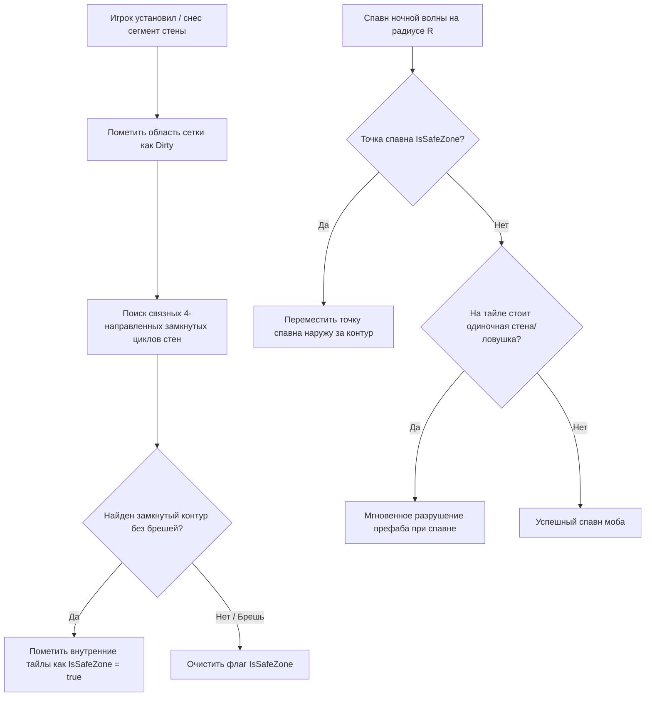

# Technical Architecture Document (TDD): Project "Cube Siege"

> **Статус**: Архитектурная спецификация (Обновлено по результатам технического аудита)  
> **Роль**: Lead Technical Architect & Systems Engineer  
> **Версия**: 1.3.0  
> **Стек (Текущий)**: Godot Engine 4.6 + GDScript Core + EventBus + Base Class Hierarchy  
> **Стек (Целевой / Масштабирование)**: C++ (GDExtension) для Swarm/Flowfield + GDScript UI  

---

## 1. Архитектурный стиль и технологический стек

### 1.1. Текущая архитектура (GDScript Core + Event Bus)
- **Игровой движок**: Godot Engine 4.x (4.6 Forward Plus).
- **Слабая связанность через `EventBus`** (`scripts/event_bus.gd`):
  Центральный узел сигналов для взаимодействия систем без прямых циклических ссылок:
  - `resources_changed`, `building_placed`, `building_destroyed`
  - `day_started`, `night_started`, `wave_started`, `wave_cleared`
  - `player_health_changed`, `player_xp_changed`, `player_level_up`, `player_class_changed`, `player_died`
  - `boss_spawned`, `boss_defeated`
- **Иерархия базовых классов**:
  - `EnemyBase` (`scripts/enemy_base.gd`): общий базовый класс для рядовых врагов (`enemy_dummy.gd`), стрелков (`ranged_skirmisher.gd`) и таранщиков (`siege_breaker.gd`), объединяющий механику урона, шагового подъема (Voxel Step-Up), гравитации и дуэлей.
  - `TowerTargeting` (`scripts/tower_targeting.gd`): централизованная утилита поиска ближайших целей без дублирования кода.
- **Отказоустойчивость сохранений**: `SaveManager` версионирован (`SAVE_VERSION = 1`) с валидацией целостности данных при загрузке.

### 1.2. Целевой стек для оптимизации (C++ GDExtension / Roadmap)
- Для поддержки 500+ одновременных юнитов на поздних этапах запланирован перенос ресурсоемких систем в C++:
  1. *2D Flowfield Pathfinding*: вычисление волнового фронта Дейкстры на стороне нативного кода.
  2. *Swarm Simulation*: пакетная обработка физики толпы и рендеринг через MultiMeshInstance3D.
  3. *Bullet Hell / Projectiles*: пулинг и расчет траекторий сотен снарядов.

---

## 2. Ключевые алгоритмы и технические подсистемы

### 2.1. Алгоритм замкнутого контура баз (Closed Contour Safe Zone)
Для предотвращения появления противников внутри базы и защиты от эксплойта застройки карты используется алгоритм проверки связности и поиска циклов на дискретной сетке.

1. **Дискретизация**: Сетка $1 \times 1$ метр.
2. **Связность**: Учитываются только 4 ортогональных направления (N, S, E, W). Диагональные щели являются проницаемыми.
3. **Анти-спам**: Одиночные стены за экраном не создают SafeZone. Спавнящиеся мобы мгновенно разрушают одиночные преграды.

### 2.2. Система поиска пути (Pathfinding: Flowfield)
Для управления 500+ мобами используется двумерное поле течений (Flowfield):
- **Интеграционное поле (Dijkstra)**: Генерируется от позиции игрока один раз за фиксированный тик физики.
- **Векторное поле**: Каждая клетка сетки содержит нормализованный вектор направления к цели.
- **Сложность**: $O(1)$ на каждого рядового моба (моб просто считывает скорость из текущей клетки).
- **Осадные мобы**: Используют отдельный вес привлекательности к координатам возведенных префабов стен.

### 2.3. Режиссер волн (Wave Director & Throttler)
- **Кольцевой спавн (Annular Band)**:
  - Внутренний радиус: $R_{min} = \text{HalfDiagonal}(FOV) + 2.0\text{m}$.
  - Внешний радиус: $R_{max} = R_{min} + 5.0\text{m}$.
- **Дросселирование при Боссах**:
  - На 10, 20 и 30 волнах спавн свиты ограничивается жестким пулом: `ActiveMinionPool.Count <= 5`.
  - Новый миньон появляется строго взамен погибшего.

### 2.4. Боевой пайплайн и Ультимейты [F]
- **Векторный прицел**: Проекция луча из камеры в плоскость $Y=0$. Угол: $\text{atan2}(\Delta Z, \Delta X)$.
- **Парирование Воина [Q]**: Окно неуязвимости ровно 0.5с с контратакой и оглушением.
- **Ультимейт Воина («Вызов на Дуэль»)**:
  - Связка `DuelLink(Warrior, TargetEnemy)`.
  - Отключение ручного WASD, принудительный бег навстречу.
  - Цель переключается в `ForceMeleeAggro`.
  - Воин получает -40% урона от сторонних врагов и отражает им 20%. Длится до смерти одной из сторон.
- **Ультимейт Лучника («Око Снайпера»)**:
  - Пассивный компонент: `RangeMultiplier = 1.5`, смещение камеры `LookAhead` вперед.
- **Ультимейт Инженера («Ракетный залп / Nuke»)**:
  - AoE радиус 10м с телеграфом 1.2с, колоссальный урон и остаточная зона горения на 5 секунд.

---

## 3. Схема сохранения и Permadeath

1. **Ростер выживших**: Локальный зашифрованный JSON со списком эвакуированных героев и распределенными очками Дерева Мастерства (до 100 ур.).
2. **Смерть в забеге (`OnPlayerDeath`)**: Мгновенное удаление профиля персонажа из файла сохранения без возможности восстановления.
3. **Эвакуация через Портал (`OnPortalExtract`)**: Расчет и зачисление Боевого Опыта, сохранение прогресса.
