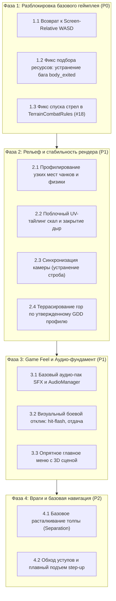

# 🛡️ Cube Siege — Технический аудит и предложения по стабилизации вертикального среза

> **Статус документа**: Технический аудит и проект предложений по стабилизации (*на рассмотрении Product Owner / Game Designer*)  
> **Контракт задачи**: GitHub Issue #20 («Провести аудит текущего состояния игры и восстановить ощущение качества вертикального среза»)  
> **Иерархия решений**:
> 1. **Категория А (Утверждено)**: Действующие контракты (Issue #18, Issue #14, GDD, ARCHITECTURE.md).
> 2. **Категория Б (Технические факты)**: Проверенные по коду и воспроизведению инженерные причины багов.
> 3. **Категория В (DESIGN DECISION REQUIRED)**: Новые геймдизайнерские предложения и балансные числа, ожидающие утверждения владельца проекта.

---

## 1. Введение и цели аудита

Проект **Cube Siege** накопил обширный объём реализованных подсистем:
- процедурный воксельный мир с дискретными высотами (Лес, Равнина, Горы);
- три класса персонажей с уникальными анимациями, оружием и наборами атак (Воин, Лучник, Инженер);
- система строительства стен, оборонительных башен, ловушек и верстака;
- смена дня и ночи, циклы ночных осад с боссами и детекция безопасных зон;
- мета-прогрессия (SaveManager v2, дерево талантов, ростер героев).

Однако накопление систем без глубокой стабилизации базового взаимодействия привело к синдрому **«функционально работает в тестах, но ощущается сырым и неотзывчивым в живой игре»**.

Цель настоящего аудита — **точно локализовать инженерные и геймдизайнерские первопричины плохого игрового опыта**, отделить подтвержденные факты от гипотез, сохранить утвержденные архитектурные инварианты и предложить взвешенный план стабилизации.

---

## 2. Анализ 10 проблемных зон: симптомы, первопричины и решения

### 2.1. Первое впечатление от игры и аудиовизуальный вакуум

* **Симптомы**:
  - При запуске игры игрок видит абсолютно пустой темный экран (`01_main_menu.png`) с мелким системным шрифтом и тремя плоскими темными кнопками («ИГРАТЬ», «НАСТРОЙКИ», «ВЫХОД»).
  - В проекте царит **полная гробовая тишина**: в репозитории нет ни одного аудиофайла (`.wav`, `.ogg`, `.mp3`), шина `AudioServer` не используется.
  - Первая сцена встречает игрока плоской поляной с порталом, окруженной беспорядочно насыпанными кубическими деревьями и камнями. Враги — примитивные красные пилюли (`enemy_dummy`), безлико бегущие по прямой.
* **Первопричины (Категория Б — Технический факт)**:
  - Главное меню (`scenes/main_menu.tscn`) сверстано как черновой 2D-интерфейс без фонового 3D-мира, виньетирования, освещения или анимации персонажей.
  - Аудиофайлы отсутствуют во всем дереве проекта. Без звукового фидбека действия игрока (удары мечом, выстрелы, сбор ресурсов) воспринимаются мозгом как бестелесные и лишенные массы.
* **Предлагаемое решение**:
  - *Категория Б (Инженерия)*: Добавить легковесный 3D-вьюпорт в главное меню (персонаж у костра на вращающейся подставке) и базовый класс-менеджер звуков.
  - *Категория В (DESIGN DECISION REQUIRED)*: Согласовать состав минимального базового аудио-пака (удары, шаги, тетива, попадания, сбор ресурсов, эмбиентный ветер, UI-клики).

---

### 2.2. Рендер, графический пайплайн и строб при движении

* **Симптомы**:
  - Долгий первый старт билда и компиляция шейдеров.
  - Ощущение «размытия», смазывания и строба (micro-stutter) при ходьбе персонажа.
  - Песок и субпиксельное мерцание («кипение пикселей») на стыках вокселей и текстурах террейна при движении изометрической камеры.
* **Первопричины (Категория Б — Технический факт)**:
  - В `project.godot` выбран `Forward Plus` (Desktop Vulkan). Для проекта с 1 источником света (`SunLight`) и стилизованными вокселями возможности Vulkan Clustered/SDFGI не используются, создавая неоправданный оверхед.
  - **Рассинхронизация тиков физики и рендера**: персонаж перемещается в `_physics_process(delta)` (60 Гц дискретно), а камера следует за ним в `_process(delta)` (120/144 Гц) через `global_position.lerp(target.global_position + ...)`. В Godot 4 параметр `physics/common/physics_interpolation` отключен по умолчанию. На дисплеях с частотой выше 60 Гц позиция игрока половину кадров рендера не обновляется, а затем скачет вперед, что воспринимается как строб/смаз.
  - Текстуры террейна используют `TEXTURE_FILTER_NEAREST` без мипмапов, порождая алиасинг субпиксельных контрастных точек под углом 45°.
* **Предлагаемое решение**:
  - *Категория Б (Инженерия)*: Синхронизировать перемещение камеры с физическим тиком игрока (либо переместить follow-логику в `_physics_process`, либо включить физическую интерполяцию Godot 4).
  - *Категория В (DESIGN DECISION REQUIRED)*: Выбрать целевой графический бэкенд проекта: переключение на `Mobile` (Vulkan Mobile) или `Compatibility` (OpenGL 3) против сохранения `Forward Plus` с точечной оптимизацией.

---

### 2.3. Производительность: гипотезы и обязательное профилирование

* **Симптомы**:
  - Наблюдаемые задержки и фризы при пересечении границы чанков во время исследования мира и при спавне крупных ночных волн.
* **Гипотезы источников узких мест (Категория Б — Технический анализ)**:
  - *Гипотеза 1 (Множественные SceneTree ноды ресурсов)*: В `MapGenerator._spawn_chunk_resources` на каждой из 256 клеток чанка 16x16 проводится попытка спавна с вероятностью $p = 0.16$. Это биномиальное распределение со средним $\mu = 256 \times 0.16 \approx 41$ попытка на чанк (дисперсия $\sigma^2 \approx 34.4$). При 49 активных чанках в SceneTree единовременно может существовать от 1500 до 2000 индивидуальных узлов (`StaticBody3D`, `Area3D`), что может нагружать SceneTree и физический сервер при вызовах `instantiate()`.
  - *Гипотеза 2 (GDScript физика толпы)*: Каждый враг управляется как отдельный `CharacterBody3D` с `move_and_slide()` и циклом проверок столкновений для step-up.
* **Обязательный порядок действий (согласно контракту Issue #20)**:
  1. **Инструментальное профилирование ПРЕЖДЕ оптимизаций**: Запустить Godot Profiler и замерить метрики:
     - `Frame Time` (CPU Process vs Physics Process vs Render);
     - Время выполнения `_spawn_chunk_resources` при пересечении границы чанка;
     - Нагрузка физического сервера (`Physics Server 3D / Collision Pairs`) от ресурсных нод;
     - Влияние количества мобов на фреймрейт.
  2. **Реализация только подтверждённых профилированием решений**:
     - Если подтвердится bottleneck инстанцирования: объединение декораций (трава, камни) в `MultiMeshInstance3D` и пул объектов.
     - Если подтвердится bottleneck физики толпы: переход на C++ Flowfield, как утверждено в Milestone 5.

---

### 2.4. Процедурная генерация мира: горы, ресурсы и окружение

#### А. Горы («Зебра-лестницы» и хаос рельефа)
* **Симптомы**:
  - Горы в текущем билде (`03_mountain_biome_altitude_50.png`) выглядят как полосатые зубья и зигзагообразные диагональные лестницы с черными провалами каждый метр.
* **Первопричина (Категория Б — Технический факт)**:
  - В `BiomeSystem.sample_height` крутой подъем `MOUNTAIN_CLIMB_SLOPE = 0.70` смешивается с высокочастотным шумом (`frequency = 0.04`), после чего берется `roundf()`. При шаге сетки 1м почти каждая пара клеток дает перепад высоты ровно в 1 блок. Это приводит к непрерывной пилообразной «зебре» из 1-блочных ступеней вместо естественных массивов.
* **Предлагаемое решение**:
  - *Категория А (Утверждено)*: Сохранение правила проходимости уступов $|\Delta h| \le 1$ и гарантированной тропы к высотам $50+$ и $100+$ (Issue #18).
  - *Категория В (DESIGN DECISION REQUIRED)*: Утвердить переход к **террасированному профилю**: квантовать рельеф не по непрерывному шуму, а ступенями с широкими плато (например, террасы шириной 8–16м с четкими уступами высотой 2–3 блока, снабженными проходимыми лестницами/тропами).

#### Б. Ресурсы (Перенасыщение и распределение)
* **Симптомы**:
  - Ресурсы насыпаны равномерно по всей карте без естественных полян и рощ.
* **Первопричина (Категория Б — Технический факт)**:
  - Независимый случайный бросок на каждую клетку чанка ($p = 0.16$) порождает равномерный белый шум по всей карте.
* **Предлагаемое решение (Категория В — DESIGN DECISION REQUIRED)**:
  - Согласовать переход к **кластерному распределению** (перлин-шум плотности / биомные зоны: «роща», «каменная гряда», «жила руды») с образованием свободных полян для строительства и маневра.
  - Согласовать баланс: кратность снижения плотности объектов и компенсацию выхода ресурсов с одного месторождения.

#### В. Камни и окружение
* **Симптомы**:
  - Одиночные наклоненные кубы камней хаотично разбросаны прямо по ступеням скал.
* **Предлагаемое решение (Категория В — DESIGN DECISION REQUIRED)**:
  - Спавнить камни группами у подножия скальных уступов (эффект осыпей), оставляя ровные плато чистыми для геймплея.

---

### 2.5. Геометрия блоков и визуальная целостность мира

* **Симптомы**:
  - На стыках обрывов и границах стриминга видна пустота (void).
  - Вертикальные скалы представляют собой единый полигон с вертикально растянутой текстурой (`05_biome_transition_plains_mountains.png`).
* **Первопричины (Категория Б — Технический факт)**:
  - `ChunkBuilder` строит боковую стенку вниз только до высоты соседа `yn`. На внешних границах окна стриминга или глубоких перепадах образуются сквозные щели.
  - UV боковых граней в `_add_quad` жестко нормализован от 0 до 1: при перепаде в несколько блоков текстура растягивается по вертикали.
* **Предлагаемое решение (Категория Б — Инженерия)**:
  - Рассчитывать UV вертикальных граней пропорционально реальной высоте перепада (`uv.y = y_top - y_bot`), обеспечивая поблочный тайлинг без растяжения.
  - Добавить нижнюю заглушку (юбку геометрии чанка), полностью закрывающую просвечивание пустоты под уступами.

---

### 2.6. Управление персонажем: возврат к экранным координатам (Screen-Relative)

* **Симптомы**:
  - Персонаж слушается неинтуитивно, кайтинг мобов с одновременной стрельбой/атакой дезориентирует.
* **Первопричина (Категория Б — Технический факт)**:
  - В рамках задачи #16 WASD-движение было привязано к вектору прицела мыши (`orientation.aim_direction`). Нажатие `W` двигает персонажа в сторону курсора, что заставляет игрока мысленно вращать оси ввода при каждом движении мыши.
* **Предлагаемое решение (Категория А / Канонический ARPG контракт)**:
  - **Базовое экранно-изометрическое WASD-перемещение (Default Locomotion)**:
    - `W` — движение вверх по экрану (вперед по изометрии);
    - `S` — движение вниз по экрану (назад по изометрии);
    - `A` — движение влево по экрану;
    - `D` — движение вправо по экрану.
  - **Сохранение специального контракта принудительной цели (`forced_target`)**:
    - При наличии валидной принудительной цели (`forced_target != null`) базис ручного WASD-движения переключается на относительный вектор к цели (`[W]` к цели, `[S]` от цели, `[A]`/`[D]` орбитальный стрейф вокруг цели).
  - **Сохранение перехвата движения Дуэлью (Duel Override)**:
    - В режиме «Дуэль» Воина (`is_dueling == true`) ручное перемещение WASD отключается, а локомоция полностью перехватывается автоматическим контроллером дуэли (`process_duel_movement`), стягивающим героя к оппоненту.
  - Курсор мыши в стандартном режиме используется исключительно для направления атак, траектории снарядов, выбора целей способностей и ориентации верхней части тела.

---

### 2.7. Камера и читаемость поля боя

* **Симптомы**:
  - Микро-рывки камеры при движении, перекрытие обзора кронами деревьев.
* **Первопричины (Категория Б — Технический факт)**:
  - Рассинхронизация тиков обновления позиции (см. п. 2.2).
  - Высокая плотность высоких деревьев возле стартовой зоны портала.
* **Предлагаемое решение**:
  - *Категория Б (Инженерия)*: Синхронизировать слежение камеры с пост-физическим шагом.
  - *Категория А (Утверждено)*: Сохранить канонический угол 45° и пресеты дистанций (Close/Medium/Far, Issue #14).
  - *Категория В (DESIGN DECISION REQUIRED)*: Настройка радиуса стартовой зоны расчистки вокруг портала и порога полупрозрачности крон деревьев.

---

### 2.8. Бой и взаимодействие с высотой (Локализация бага в рамках контракта #18)

* **Симптомы**:
  - При стрельбе лучником с холма или уступа вниз по врагам стрелы пролетают над головами врагов и не наносят урона.
* **Анализ контракта Issue #18 (Категория А — Утверждено)**:
  - Задача #18 явно зафиксировала **дискретные правила связности высот**:
    - $|\Delta h| \le 1$: пологий проходимый шаг, снаряд плавно повторяет рельеф;
    - $\ge +2$: непреодолимая стена, снаряд врезается и разрушается;
    - $\le -2$: обрыв, снаряд летит горизонтально над пропастью без пикирования в каньон.
  - **Свободная 3D-баллистика и свободный 3D-Raycast урон исключены действующим контрактом.**
* **Локализация первопричины бага (Категория Б — Технический факт)**:
  - В `scripts/combat/terrain_combat_rules.gd` строка 107 содержит расчет:
    ```gdscript
    var clearance: float = current_pos.y - next_terrain_y
    var currently_over_drop: bool = is_over_drop or int_step <= -2 or (clearance >= projectile_base_offset + 1.2)
    ```
    При выстреле вниз по последовательным ступенькам рельефа (каждая со сносом $\Delta h = -1$):
    1. На первой ступени высота террейна снижается на 1 блок.
    2. На второй ступени суммарный клиренс `current_pos.y - next_terrain_y` превышает `0.8 + 1.2 = 2.0` блока.
    3. Флаг `currently_over_drop` **преждевременно становится `true`**, хотя впереди нет обрыва $\le -2$, а идет обычный проходимый склон!
    4. Как только `currently_over_drop` взводится, строка 128 принудительно замораживает высоту стрелы:
       `return { "collided": false, "new_y": current_pos.y, ... }`.
    5. Стрела перестает плавно спускаться по ступенькам и зависает на высоте исходного уступа, пролетая на высоте нескольких метров над хитбоксами врагов внизу.
* **Исправление с сохранением контракта Issue #18 (Категория Б — Инженерия)**:
  - Исправить условие `currently_over_drop` в `TerrainCombatRules.update_projectile_height`:
    - Проверять перепад высоты между соседними клетками `int_step <= -2`, а не накопительный клиренс над пологим склоном.
    - Пока склон последовательно спускается шагами $-1$ блок (`int_step == -1`), стрела обязана продолжать штатный плавный спуск к уровню следующего блока, оставаясь на рабочей высоте контакта с хитбоксами врагов.

---

### 2.9. Способности и боевой отклик (Game Feel / Juice)

* **Симптомы**:
  - Атаки ощущаются «картонными», попадания не приносят удовлетворения.
* **Первопричины (Категория Б — Технический факт)**:
  - Полное отсутствие аудио-сопровождения атак и ударов.
  - Отсутствие анимации реакции на удар у врагов (нет вспышки силуэта, нет микро-отдачи).
* **Предлагаемое решение**:
  - *Категория Б (Инженерия)*: Поддержка шейдера белой вспышки (hit-flash) на материале врага и импульса micro-knockback при контакте хитбокса.
  - *Категория В (DESIGN DECISION REQUIRED)*: Утвердить стандарт боевого отклика (длительность вспышки 0.05с, допустимость и амплитуда screen-shake для критических атак и ультимейтов).

---

### 2.10. Блокирующие баги систем, мешающие полноценному тестированию

* **Симптомы и локализация первопричин**:
  1. **Невозможность подобрать добытые ресурсы (Категория Б — Технический факт)**:
     - При разрушении дерева/камня вызывается `fell_tree()` / `destroy_rock()`:
       `$CollisionShape3D.set_deferred("disabled", true)`.
     - Отключение коллизии в Godot генерирует сигнал `body_exited` на узле `InteractionSensor` игрока.
     - Обработчик сенсора игрока удаляет узел из кандидатов: `candidate_nodes.erase(node)`.
     - Срубленный пень больше никогда не регистрируется сенсором как кандидат на сбор — клавиша `[E]` не срабатывает.
     - *Решение*: При разрушении объекта спавнить отдельный интерактивный узел дропа (или сразу начислять ресурсы в кошелек).
  2. **Примитивный ИИ и передвижение врагов (Категория Б — Технический факт)**:
     - В `enemy_dummy.gd` враги двигаются прямолинейно по вектору `(player - pos).normalized() * speed`.
     - Нет обработки препятствий: мобы упираются в скалы выше 1 блока и застревают.
     - Нет расталкивания (Separation): десятки врагов слипаются в единую точку.
  3. **Резкое авто-взбирание (Категория Б — Технический факт)**:
     - При шаге на ступеньку вызывается дискретное `global_position.y += 1.05`, создавая резкие вертикальные рывки.
* **Предлагаемые решения**:
  - *Категория В (DESIGN DECISION REQUIRED)*:
    - Выбрать модель сбора добытых ресурсов: автоматический притягивающийся лут (магнит) vs мгновенный сбор при проходе по клетке vs быстрое нажатие [E] без удержания.
    - Утвердить минимальный радиус расталкивания врагов (например, 0.8м) до внедрения полноценного C++ Flowfield.

---

## 3. Матрица проблем и порядок важности

| Приоритет | Проблема | Категория решения | Влияние на билд |
| :--- | :--- | :--- | :--- |
| **P0 (Блокер)** | **Сломанный подбор срубленных ресурсов** | Категория Б (Фикс бага `body_exited`) + Категория В (Формат дропа) | Блокирует сбор ресурсов, постройку базы и починку портала. |
| **P0 (Блокер)** | **Инвертированное/неинтуитивное WASD управление** | Категория А (Возврат к Screen-Relative WASD; сохранение `forced_target` и Duel override) | Критическое отторжение при первом контакте с управлением. |
| **P0 (Блокер)** | **Стрелы с возвышенности зависают над врагами** | Категория Б (Фикс преждевременного `currently_over_drop` в рамках #18) | Ломает стрельбу лучника с холмов и гор. |
| **P1 (Качество)** | **Гробовая тишина (полное отсутствие звука)** | Категория Б (Менеджер звуков) + Категория В (SFX-пак) | Разрушение погружения и физического ощущения атак. |
| **P1 (Качество)** | **Микро-строб и смазывание при движении** | Категория Б (Синхронизация тиков камеры с физикой игрока) | Иллюзия низкой производительности при высоком FPS. |
| **P1 (Качество)** | **Зебра-лестницы гор и хаос рельефа** | Категория А (Правило $\le 1$) + Категория В (Террасированный профиль) | Рельеф выглядит как визуальный глитч. |
| **P1 (Качество)** | **Растянутые текстуры скал и дыры в пустоту** | Категория Б (Поблочный UV-тайлинг и нижняя юбка геометрии) | Нарушение визуальной целостности воксельного мира. |
| **P2 (Полировка)**| **Профилирование и оптимизация стриминга чанков** | Категория Б (Обязательные замеры в Profiler до оптимизаций) | Устранение спайков кадра при исследовании мира. |
| **P2 (Полировка)**| **Слипание врагов в одну точку и застревание** | Категория В (Расталкивание толпы и базовый обход скал) | Повышение тактического качества ночных осад. |
| **P2 (Полировка)**| **Пустое и мрачное главное меню** | Категория Б (3D сцена-диорама в меню) | Формирование первого впечатления законченной игры. |

---

## 4. Реестр временных прототипов и гипотез

| Компонент / Механика | Текущее состояние в коде | Статус / Вердикт | Что требуется сделать |
| :--- | :--- | :--- | :--- |
| **Aim-relative WASD** | Привязка осей движения к углу мыши в `player_movement_math.gd` | Временный эксперимент (#16) | **Заменить**: возврат к экранно-изометрическому WASD с сохранением `forced_target` и Duel override. |
| **Удержание [E] 1.0с для срубленного дерева** | Задержка на пеньке, ломающаяся из-за отключения коллизии | Черновая механика | **Заменить**: переход на физический дроп / быстрый сбор. |
| **Вычисление спуска стрелы в `TerrainCombatRules`** | Клиренс $\ge 2.0$ над пологим склоном блокирует снижение стрелы | Инженерный баг логики | **Исправить**: сохранять спуск при шагах $-1$ в рамках контракта #18. |
| **Квадовые скалы с UV [0..1]** | Текстура скалы растягивается на всю высоту обрыва | Черновая геометрия | **Заменить**: поблочный тайлинг по метрам высоты. |
| **Камера в свободном `_process`** | Интерполяция не синхронизирована с физическим шагом | Черновой скрипт | **Заменить**: синхронизация с тиками физики персонажа. |
| **Прямолинейный векторный бег врагов** | Бег по вектору без учета соседей и уступов | Прототип раннего этапа | **Доработать**: добавить разделение толпы (Separation) до C++ Flowfield. |
| **Гипотеза о тормозах спавна чанков** | Биномиальный спавн со средним $\mu \approx 41$ нода на чанк | Неподтвержденная гипотеза | **Измерить**: снять профили в Godot Profiler перед рефакторингом. |

---

## 5. Предлагаемый пошаговый план стабилизации (Roadmap)



---

## 6. Критерии готовности (Definition of Ready) для возврата к новым фичам

Возврат к разработке новых крупных игровых возможностей (новые классы, таланты, новые биомы, контент) рекомендуется производить **только после выполнения следующих условий**:

1. [ ] **Управление**: Персонаж управляется классическим экранно-изометрическим WASD независимо от положения курсора мыши (спец-контракт `forced_target` и Duel override сохранены).
2. [ ] **Экономический цикл**: Деревья и камни добываются оружием, ресурсы стабильно подбираются игроком без зависаний и потери таргета.
3. [ ] **Вертикальный бой**: Выстрелы лучника со склонов и уступов стабильно поражают врагов внизу согласно дискретным правилам высот Issue #18.
4. [ ] **Визуальная целостность**: Текстуры скал не растянуты, сквозь карту не видна пустота, рельеф читаем для игрока.
5. [ ] **Плавность рендера**: Движение камеры синхронизировано с физикой, отсутствует строб и фазовое размытие.
6. [ ] **Аудио-отклик**: Базовые действия (удар, выстрел, получение урона, шаг, сбор) сопровождаются звуковым фидбеком.
7. [ ] **Подтверждение профилированием**: Замерено время кадра при стриминге чанков, устранены реальные спайки.
