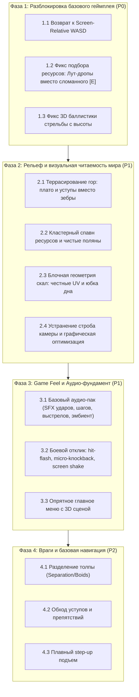

# 🛡️ Cube Siege — Аудит текущего состояния и план стабилизации вертикального среза

> **Статус документа**: Утверждённый технический аудит и дорожная карта стабилизации  
> **Контракт задачи**: GitHub Issue #20 («Провести аудит текущего состояния игры и восстановить ощущение качества вертикального среза»)  
> **Область применения**: Руководство для инженеров и геймдизайнера по стабилизации базового игрового цикла перед добавлением нового контента.

---

## 1. Введение и цели аудита

Проект **Cube Siege** накопил обширный объём реализованных подсистем:
- процедурный воксельный мир с биомами и перепадами высот (Лес, Равнина, Горы);
- три класса персонажей с уникальными анимациями, оружием и наборами атак (Воин, Лучник, Инженер);
- система строительства стен, оборонительных башен, ловушек и верстака;
- смена дня и ночи, циклы ночных осад с боссами и детекция безопасных зон;
- мета-прогрессия (SaveManager v2, дерево талантов, ростер героев).

Однако накопление систем без глубокой полировки базового взаимодействия привело к синдрому **«функционально работает в тестах, но ощущается сырым и неотзывчивым в живой игре»**.

Цель настоящего аудита — не критиковать прототип, а **точно локализовать инженерные и геймдизайнерские первопричины плохого игрового опыта**, разделить фундаментальные решения и временные «костыли», а также сформировать строгий приоритетный план стабилизации.

---

## 2. Анализ 10 проблемных зон: симптомы, первопричины и решения

### 2.1. Первое впечатление от игры и аудиовизуальный вакуум

* **Симптомы**:
  - При запуске игры игрок видит абсолютно пустой темный экран (`01_main_menu.png`) с мелким системным шрифтом и тремя плоскими темными кнопками («ИГРАТЬ», «НАСТРОЙКИ», «ВЫХОД»).
  - В проекте царит **полная гробовая тишина**: в репозитории нет ни одного аудиофайла (`.wav`, `.ogg`, `.mp3`), шина `AudioServer` не используется.
  - Первая сцена встречает игрока плоской поляной с порталом, окруженной беспорядочно насыпанными кубическими деревьями и камнями. Враги — примитивные красные пилюли (`enemy_dummy`), безлико бегущие по прямой.
* **Первопричины**:
  - Главное меню (`scenes/main_menu.tscn`) сверстано как черновой 2D-интерфейс без фонового 3D-мира, виньетирования, освещения или анимации персонажей.
  - Аудиосистема была отложена на Milestone 4 (`docs/BACKLOG.md`), но без звука мозг игрока воспринимает любые действия (удары мечом, попадания стрел, разрушение деревьев) как «неработающие» и лишенные физической массы.
* **Техническое решение**:
  1. Внедрить легковесный фоновый 3D-диорамный виджет в главное меню (освещенный воксельный персонаж у костра/портала на вращающейся подставке).
  2. Подключить минимальный базовый SFX-пак (10–12 звуков: шаг, взмах мечом, звук тетивы лука, удар по дереву/камню, получение урона, клик кнопки UI, эмбиентный ветер).
  3. Стилизовать UI: нормальные шрифты, контрастные рамки кнопок, читаемые плашки ресурсов с иконками вместо текста `WOOD: 0 / 25`.

---

### 2.2. Рендер, графический пайплайн и строб при движении

* **Симптомы**:
  - Долгий первый старт билда и компиляция шейдеров.
  - Ощущение «размытия», смазывания и строба (micro-stutter) при ходьбе персонажа.
  - Песок и субпиксельное мерцание («кипение пикселей») на стыках вокселей и текстурах террейна при движении изометрической камеры.
* **Первопричины**:
  - В `project.godot` выбран `Forward Plus` (Desktop Vulkan). В проекте используется 1 источник направленного света (`SunLight`), простые материалы и воксели. Возможности Vulkan Clustered/SDFGI не задействованы, но накладные расходы Vulkan создают задержки инициализации и тяжелый графический конвейер.
  - **Рассинхронизация тиков физики и рендера**: персонаж перемещается в `_physics_process(delta)` (60 Гц дискретно), а камера следует за ним в `_process(delta)` (120/144 Гц) через `global_position.lerp(target.global_position + ...)`. Физическая интерполяция в Godot 4 отключена (`physics/common/physics_interpolation` не активирован). На экранах с высокой частотой кадров позиция игрока половину кадров стоит на месте, а затем скачет вперед, что зрительно воспринимается как «смазывание и микро-дёрганье».
  - Текстуры террейна используют `TEXTURE_FILTER_NEAREST` без мипмапов, а наклонная изометрическая плоскость под углом 45° порождает алиасинг субпиксельных контрастных точек (желто-белые дизеринговые крапинки в текстуре травы).
* **Техническое решение**:
  1. Переключить проект на **`Mobile`** (Vulkan Mobile) или **`Compatibility`** (OpenGL 3): это снизит потребление VRAM, ускорит запуск и устранит лишние этапы рендера.
  2. Включить гладкую синхронизацию камеры: переместить слежение камеры в `_physics_process` после расчета движения игрока ИЛИ включить 3D Physics Interpolation в настройках проекта.
  3. Включить FXAA / MSAA 2x и добавить базовую фильтрацию/мипмапы на текстурах ландшафта, убрать высококонтрастный точечный дизеринг с текстур земли.

---

### 2.3. Производительность и реальные узкие места (Bottlenecks)

* **Симптомы**:
  - Падение FPS и фризы при пересечении границы чанков во время исследования мира.
  - Просадки частоты кадров при появлении волны врагов от 30+ мобов.
* **Первопричины**:
  - **Инстанцирование сотен сцен в главном потоке**: В `MapGenerator._spawn_chunk_resources` на чанк 16x16 клеток спавнится до 40 индивидуальных объектов (деревья, камни, руда, трава). При активных 49 чанках в SceneTree висит свыше 1800 индивидуальных узлов `StaticBody3D` и `Area3D`! Вызов `instantiate()` и добавление десятков узлов на кадр блокирует главный поток Godot.
  - **GDScript физика мобов**: Каждый враг — отдельный `CharacterBody3D` с вызовом `move_and_slide()` и циклом проверок столкновений для step-up.
* **Техническое решение**:
  1. Декоративные элементы (траву, цветы, мелкие камни) полностью перевести на **`MultiMeshInstance3D`** (1 Draw Call на чанк вместо сотен нод).
  2. Снизить базовую частоту спавна ресурсных месторождений в 3–4 раза (см. п. 2.4).
  3. Использовать предварительный пул объектов (Object Pool) или разгрузку спавна ресурсов через очереди генерации.
  4. Подготовить почву для перехода на C++ GDExtension Pathfinding (Flowfield) при масштабировании волн до 100+ мобов.

---

### 2.4. Процедурная генерация мира: горы, ресурсы и окружение

#### А. Горы («Зебра-лестницы» и хаос рельефа)
* **Симптомы**:
  - Горы в текущем билде (`03_mountain_biome_altitude_50.png`) выглядят как бесконечные полосатые зубья и зигзагообразные диагональные лестницы с черными провалами каждый метр.
  - На рельефе невозможно ориентироваться, трудно драться и неудобно ходить.
* **Первопричина**:
  - В `BiomeSystem.sample_height` задан крутой градиент `MOUNTAIN_CLIMB_SLOPE = 0.70` (подъем на 0.7 блока на каждый метр дистанции), смешанный с высокочастотным симплекс-шумом (`frequency = 0.04`), после чего берется `roundf()`. В сетке 1x1м это означает, что почти каждая диагональная пара клеток имеет перепад высоты ровно в 1 блок. Вместо природных форм получается пилообразная зебра из 1-блочных ступеней.
* **Техническое решение**:
  1. Ввести **террасированный профиль (Step/Terrace Quantization)**:
     - Высота гор должна квантоваться не по `roundf(h)`, а через широкие плато: ступени высотой 2–3 блока с плоскими террасами шириной 8–16 метров.
     - Профиль высоты: **Предгорья (Foothills)**: пологие холмы 0..+3 блока → **Уступы (Escarpments)**: четкие читаемые скалы высотой 2–3 блока → **Плато и вершины (Plateaus/Peaks)**: просторные плоские участки для битв и построек.
     - Натуральные тропы (Trails) должны оставаться пологими дорогами с гладким подъемом.

#### Б. Ресурсы (Перенасыщение и хаотичный сев)
* **Симптомы**:
  - Ресурсы насыпаны равномерным «ковром» по всей карте; свободного пространства для маневра и строительства нет.
* **Первопричина**:
  - В `MapGenerator._spawn_chunk_resources` каждая клетка чанка делает независимый бросок `rng.randf() <= 0.16` (16% шанс на каждую из 256 клеток).
* **Техническое решение**:
  1. Перейти от сеточного белого шума к **кластерному распределению (Clustered Spawning)**:
     - Использовать низкочастотный шум плотности или Voronoi-паттерны: «Березовая роща», «Каменная гряда», «Железная жила».
     - Между кластерами должны быть чистые открытые поляны (Glades) для возведения баз и ведения мобильного боя.
  2. Сократить общее количество ресурсных нод в 3 раза, пропорционально повысив выход ресурсов с одного объекта.

#### В. Камни и декор
* **Симптомы**:
  - Одиночные кубы камней разбросаны под случайными углами прямо на склонах гор, создавая ощущение мусора.
* **Техническое решение**:
  1. Камни и валуны спавнить **группами у подножия скальных уступов** (эффект осыпи/тальвега), а не на открытых ступенях.
  2. Траву и цветы высаживать пятнами на равнинах.

---

### 2.5. Геометрия блоков и визуальная целостность мира

* **Симптомы**:
  - На стыках обрывов и по краям чанков видна пустота (void / серое небо).
  - Вертикальные скалы высотой 5–10 метров представляют собой единый вытянутый полигон с чудовищно растянутой 16-пиксельной текстурой (`05_biome_transition_plains_mountains.png`).
  - Поверхность земли плоская, без затенения между блоками.
* **Первопричины**:
  - `ChunkBuilder` строит только верхнюю крышку блока (`p0..p3`) и боковую стенку вниз до высоты соседней клетки `yn`. Если соседний чанк еще не прогружен или перепад уходит вглубь, образуется сквозная дыра в пустоту.
  - UV-развертка боковых граней (`_add_quad`) жестко прописана от 0 до 1 независимо от высоты перепада: при обрыве в 6 блоков текстура растягивается в 6 раз.
* **Техническое решение**:
  1. **Мировой маппинг UV (World-aligned UV)**: текстура на скалах должна повторяться (тайлиться) кратно 1 блоку (`uv.y = y_top - y_bot`), сохраняя одинаковый размер пикселей на горизонтальных и вертикальных гранях.
  2. **Юбка дна (Skirt / Foundation geometry)**: генерировать внешнюю геометрию на внешних границах карты и под скалами, гарантирующую отсутствие видимых дыр в пустоту при любом ракурсе камеры.
  3. **Псевдо-AO (Ambient Occlusion)**: затемнять вершины в углах стыковки горизонтальных плоскостей с вертикальными уступами для создания эффекта объема.

---

### 2.6. Управление персонажем: возврат к экранным координатам (Screen-Relative)

* **Симптомы**:
  - Управление персонажем ощущается крайне неудобно, кайтинг мобов дезориентирует.
* **Первопричина**:
  - В рамках задачи #16 была внедрена экспериментальная схема: WASD-движение рассчитывается относительно направления прицела курсора мыши (`orientation.aim_direction`). Если игрок целится вправо и жмет 'W', персонаж бежит вправо. Если при этом повести мышь назад, вектор 'W' разворачивается на 180°. Игрок не может одновременно бежать назад-влево и целиться вперед-вправо без постоянного мысленного пересчета базиса.
* **Техническое решение**:
  - **Безоговорочный возврат к каноническому экранному/изометрическому WASD**:
    - **WASD управляет вектором движения строго относительно экрана**:
      - `W` — движение вверх по экрану (вперед по изометрии);
      - `S` — движение вниз по экрану (назад по изометрии);
      - `A` — движение влево по экрану;
      - `D` — движение вправо по экрану.
    - **Курсор мыши управляет исключительно прицеливанием (Aim)**: направлением ударов, полетом стрел, размещением построек и ориентацией оружия персонажа.
    - Поворот туловища/ног: ноги и нижняя часть тела поворачиваются в сторону реального движения WASD, верхняя часть тела и оружие целятся в сторону курсора.

---

### 2.7. Камера и читаемость поля боя

* **Симптомы**:
  - Изометрическая камера периодически дрожит при перемещении.
  - Кроны деревьев и высокие скалы перекрывают персонажа и врагов.
* **Первопричины**:
  - Слежение камеры происходит с интерполяцией в `_process`, не синхронизированной с тиками физики персонажа (см. п. 2.2).
  - Слишком плотная сетка высоких деревьев прямо возле стартовой зоны.
* **Техническое решение**:
  1. Синхронизировать позиционирование камеры строго после расчета физического шага.
  2. Проверить радиус прозрачности крон (`canopy_occlusion_area`) — убедиться, что при нахождении персонажа за препятствиями срабатывает плавное растворение альфа-канала.
  3. Пресеты камеры: сделать пресет «Средне» (Medium) базовым стандартом с чистой видимостью горизонта на 25–30 метров вокруг базы.

---

### 2.8. Бой и взаимодействие с высотой

* **Симптомы**:
  - При стрельбе лучником с холма или горы вниз по врагам стрелы пролетают высоко над их головами и не наносят урона.
* **Первопричины**:
  - **Обнуление вертикального угла прицеливания**: В `PlayerAim.resolve_cursor_aim` вектор рассчитывается как `var diff = hit_pos - body_position; diff.y = 0.0`. Направление стрельбы изначально формируется строго плоским горизонтальным вектором.
  - **Принудительная фиксация высоты в воздухе**: В `TerrainCombatRules.update_projectile_height` при выстреле с возвышенности срабатывает условие `currently_over_drop = true` (пролет над обрывом), и скрипт принудительно возвращает `new_y: current_pos.y`. Стрела летит горизонтально в воздухе на высоте 6–8 метров над землей, в то время как мобы находятся внизу на высоте 0..1 метр. Стрела проходит в нескольких метрах над хитбоксами.
* **Техническое решение**:
  1. Прицеливание с мыши должно проецировать луч во все три координаты реального мира `hit_pos (X, Y, Z)` на геометрию террейна или хитбокс врага под курсором.
  2. Снаряд должен получать полноценный 3D-вектор полета от точки спавна оружия к целевой 3D-точке курсора.
  3. Алгоритм трассировки полета стрелы должен учитывать истинную баллистическую траекторию (наклонный луч) с проверкой столкновения с террейном по `RayCast3D` или пошаговому воксельному DDA.

---

### 2.9. Способности и боевой отклик (Game Feel / Juice)

* **Симптомы**:
  - Нажатие кнопок атак и скиллов не приносит удовлетворения: удары кажутся «картонными», попадания не чувствуются.
* **Первопричины**:
  - Отсутствие аудио-ударов (нет звука рассекаемого воздуха, лязга металла, хруста костей).
  - Отсутствие физического и визуального импакта: мобы при попадании почти не реагируют (только белые цифры урона без вспышки силуэта, без микро-задержки кадра hitstop и без микро-сотрясения камеры).
* **Техническое решение**:
  1. Сформулировать **Стандарт боевого отклика**:
     - **Звук**: каждый удар обязан сопровождаться звуком замаха и звуком контакта.
     - **Flash-эффект**: моб при получении урона мигает белым материалом на 0.05 сек.
     - **Hit Reaction**: легкий импульс отдачи (micro-knockback) даже у обычных атак.
     - **Screen Shake**: при критических ударах, взрыве мины Инженера или ульте Воина добавлять микро-шейк камеры на 0.15 сек с амплитудой 0.1–0.2м.

---

### 2.10. Блокирующие баги систем, мешающие полноценному тестированию

* **Симптомы и первопричины**:
  1. **Невозможность подобрать добытые ресурсы**:
     - При уничтожении дерева или каменной жилы вызывается `fell_tree()`:
       `$CollisionShape3D.set_deferred("disabled", true)`.
     - Отключение коллизии в Godot вызывает сигнал `body_exited` на `InteractionSensor` игрока.
     - Обработчик сенсора игрока удаляет объект из массива `candidate_nodes`:
       `candidate_nodes.erase(node)`.
     - В итоге срубленное дерево больше не является кандидатом для взаимодействия! Игрок стоит рядом с пеньком, жмет [E], но взаимодействие не вызывается.
     - **Решение**: При разрушении ресурса немедленно спавнить **физические лут-пикапы (Loot Drops)**, которые автоматически притягиваются к игроку (магнитный лут на дистанции 2.5м) или мгновенно поднимаются при касании, полностью исключая задержку в 1 секунду на удержание [E].
  2. **Примитивный ИИ и передвижение врагов**:
     - В `enemy_dummy.gd` враги двигаются по вектору `(target_player.global_position - global_position).normalized() * speed`.
     - Враги не умеют обходить уступы и препятствия: они упираются в скалы выше 1 блока или в деревья и вечно бегут в стену.
     - Толпа не имеет разделения (Separation): десятки врагов схлопываются в одну точку, образуя нечитаемый клубок текстур.
     - **Решение**: Добавить простейший Raycast-обход препятствий (Context Steering) для одиночных мобов и базовый радиус расталкивания (Separation radius 0.8м), пока не внедрен полноценный Flowfield в C++.
  3. **Проблемы авто-взбирания (Step-up assist)**:
     - В `enemy_base.gd` и `player_movement.gd` при обнаружении ступени вызывается мгновенное `global_position.y += 1.05`.
     - Это приводит к резким дискретным телепортациям вверх.
     - **Решение**: Сглаживать вертикальное смещение через плавную интерполяцию вертикальной скорости `velocity.y` при преодолении ступени.

---

## 3. Список главных проблем с приоритетами

| Приоритет | Проблема | Почему это критично | Влияние на билд |
| :--- | :--- | :--- | :--- |
| **P0 (Блокер)** | **Сломанный подбор срубленных ресурсов** | Игрок не может собирать древесину и камень после добычи, блокируется крафт, постройка базы и починка портала. | Блокирует прохождение основного игрового цикла. |
| **P0 (Блокер)** | **Инвертированное/неинтуитивное WASD управление** | Движение относительно курсора мыши делает игру неиграбельной для подавляющего большинства тестеров. | Критическое отторжение при первом контакте с управлением. |
| **P0 (Блокер)** | **Стрельба с высоты пролетает над врагами** | Сломана вертикальная механика боя, лучник не может защищаться с холмов. | Ломает боевую систему в горах и на холмах. |
| **P1 (Качество)** | **Зебра-лестницы гор и хаос рельефа** | Горы выглядят как графический глитч; текстуры скал чудовищно растянуты, видны дыры в пустоту. | Полное разрушение визуальной целостности мира. |
| **P1 (Качество)** | **Гробовая тишина (полное отсутствие звука)** | Игра ощущается мертвой, атаки не имеют отдачи и веса. | Разрушение иммерсии и игрового чувства («Game Feel»). |
| **P1 (Качество)** | **Микро-строб / размытие при движении камеры** | Рассинхрон физики и рендера вызывает зрительную усталость и ощущение «лагающей» игры. | Иллюзия низкой производительности даже при высоком FPS. |
| **P1 (Качество)** | **Перенасыщение карты случайными ресурсами** | 1800+ нод на карте вызывают статтеры при стриминге чанков; поле боя замусорено. | Просадки FPS и визуальная каша. |
| **P2 (Полировка)**| **Схлопывание врагов в одну точку и бег в стены** | Мобы слипаются в один силуэт и застревают в любых уступах. | Деградация тактической глубины осад. |
| **P2 (Полировка)**| **Пустое и мрачное главное меню** | Нет ощущения начала приключения. | Портит первое впечатление до начала игры. |

---

## 4. Реестр временных прототипов, подлежащих замене

В кодовой базе выявлены следующие решения, созданные как черновые заглушки, но закрепившиеся в проекте:

1. **Aim-relative WASD в `PlayerMovementMath`**:
   - *Статус*: Черновой эксперимент из Issue #16.
   - *Вердикт*: **Устранить.** Заменить на канонический экранно-изометрический базис движения.
2. **Удержание [E] 1.0с для сбора срубленного дерева**:
   - *Статус*: Временная реализация интерактивности.
   - *Вердикт*: **Заменить на лут-дропы.** Срубленный ресурс должен распадаться на физические/магнитные пикапы, подбираемые на бегу.
3. **Прямолинейный векторный бег врагов `to_player.normalized()`**:
   - *Статус*: Прототип первого дня разработки.
   - *Вердикт*: **Заменить.** Добавить базовое расталкивание толпы и обход препятствий, зафиксировать интерфейс для C++ Flowfield.
4. **Квадовая сетка скал `ChunkBuilder` с растянутыми UV**:
   - *Статус*: Простейшая процедурная генерация.
   - *Вердикт*: **Заменить.** Внедрить поблочный трипланарный маппинг без искажений текстур и юбку дна, исключающую дыры.
5. **Следование камеры через свободный lerp в `_process`**:
   - *Статус*: Простейший следящий скрипт.
   - *Вердикт*: **Заменить.** Перевести на синхронизацию с физическим шагом или активировать штатную физическую интерполяцию Godot 4.

---

## 5. Как должен выглядеть минимальный качественный вертикальный срез (Vertical Slice)

Качественный вертикальный срез Cube Siege — это **5–7 минут непрерывного, отзывчивого и целостного геймплея**, оставляющего ощущение законченной игры:

1. **Старт**:
   - Игрок запускает игру: играет атмосферный эмбиент, горит факел в опрятном меню, выбранный герой стоит в 3D на фоне воксельного форпоста.
2. **Высадка и движение**:
   - Появление у портала на залитой солнцем поляне.
   - Нажатие WASD откликается моментальным, плавным движением персонажа по экрану без смазывания и строба. Мышь свободно целится вокруг.
3. **Добыча и подготовка**:
   - Игрок подходит к дубовой роще (компактная группа из 3–4 деревьев, а не хаотичный ковер).
   - Удар мечом сопровождается звуком разрубаемой древесины, дребезгом кроны и легкой отдачей.
   - Дерево раскалывается, из него выпадают бруски древесины, которые со щелчком плавно притягиваются к герою.
4. **Рельеф и исследование**:
   - Игрок видит вдали монументальный горный массив: террасы с четкими скальными уступами, естественные каменистые осыпи и удобные перевалы. Поднявшись на уступ, лучник прицельным выстрелом поражает разведчика внизу в ущелье — стрела летит по честной 3D-траектории и втыкается во врага.
5. **Строительство и оборона**:
   - До наступления ночи игрок на заработанные ресурсы ставит частокол и баллисту у портала.
   - С наступлением ночи звучит сигнал тревоги, свет солнца сменяется багровой луной.
   - На базу накатывает волна врагов: мобы не слипаются в одну точку, а широким фронтом огибают холмы и штурмуют стены.
   - Защитные башни открывают огонь со звуками выстрелов, игрок разит врагов способностями со вспышками урона и звучным импактом.
6. **Финал ночи**:
   - Восход солнца сжигает остатки монстров, портал активируется, игрок победоносно эвакуируется.

---

## 6. Пошаговый план стабилизации (Roadmap по порядку важности)

### Детализация шагов:

#### Фаза 1: Разблокировка базового геймплея (P0)
1. **Screen-Relative WASD**: В `scripts/player/player_movement.gd` и `scripts/player/player_movement_math.gd` переключить расчет вектора движения на фиксированный экранный базис (изометрическая плоскость камеры). Курсор мыши оставить исключительно для `orientation.aim_direction` и прицеливания атак.
2. **Система лут-дропов (Loot Drops)**: При разрушении `ResourceTree` и `ResourceRock` спавнить ресурсные сферы/кубики, которые за 0.3с магнитно притягиваются к игроку при приближении на 3 метра. Убрать зависание на [E] над пеньками.
3. **3D вертикальный бой**: В `PlayerAim` сохранять вертикальный угол курсора на террейне; в `TerrainCombatRules.update_projectile_height` убрать принудительное удержание `new_y` при стрельбе вниз, перейдя к направленному 3D вектору.

#### Фаза 2: Рельеф и визуальная читаемость мира (P1)
1. **Террасирование гор**: В `BiomeSystem.sample_height` изменить формулу на ступенчатую квантовку с широкими плато (шаг 2–3 блока через 10–15 метров) и пологими предгорьями.
2. **Кластеризация ресурсов**: В `MapGenerator._spawn_chunk_resources` заменить равномерный сеточный бросок на шум плотности, снизить число объектов в 3 раза, объединить траву и камни в `MultiMeshInstance3D`.
3. **Геометрия и развертка**: В `ChunkBuilder` привязать UV вертикальных стенок к метрам высоты (поблочный тайлинг без растяжения), добавить нижнюю заглушку (юбку) для предотвращения просвечивания пустоты.
4. **Сглаживание камеры**: Привязать обновление камеры к пост-физическому шагу или включить физическую интерполяцию в `project.godot`.

#### Фаза 3: Game Feel и Аудио-фундамент (P1)
1. **SFX & Аудио**: Создать синглтон `AudioManager`, завести 12 ключевых звуков (атака, попадание, шаг, сбор ресурса, постройка, рык моба, фоновый ветер).
2. **Визуальный импакт**: Добавить шейдер белой вспышки (white flash) при получении урона врагами и легкую встряску камеры при мощных ударах.
3. **Главное меню**: Добавить на экран меню 3D воксельного героя с анимацией покоя и освещением.

#### Фаза 4: Враги и базовая навигация (P2)
1. **Разделение толпы**: Добавить врагам вектор отталкивания от соседей (`separation_force`), предотвращающий слипание в одну точку.
2. **Обход уступов**: Добавить простейшие боковые лучи (whisker raycasts) для огибания непреодолимых скал и построек.
3. **Плавный step-up**: Заменить мгновенное `global_position.y += 1.05` на плавный подъем.

---

## 7. Критерии готовности (Definition of Ready) для возврата к новым фичам

Возврат к разработке новых крупных игровых возможностей (система талантов, новые классы, новые биомы, расширение крафта) разрешается **только после выполнения следующих условий**:

1. [ ] **Управление**: Персонаж управляется классическим экранно-изометрическим WASD, не зависящим от положения мыши. Все тесты перемещения зеленые.
2. [ ] **Экономический цикл**: Деревья и камни добываются оружием, ресурсы моментально и надежно подбираются в кошелек игрока без багов и застреваний.
3. [ ] **Вертикальный бой**: Выстрелы лучника с возвышенностей стабильно попадают по целям внизу.
4. [ ] **Читаемость рельефа**: В горах отсутствуют зубчатые зебра-лестницы, террейн имеет четкие плато и уступы, текстуры не растянуты, сквозь карту не видна пустота.
5. [ ] **Плавность рендера**: Движение камеры и персонажа не вызывает строба, рывков и размытия на любых мониторах.
6. [ ] **Аудио-отклик**: Все базовые действия (шаг, удар, выстрел, получение урона, добыча) озвучены.
7. [ ] **Полноценный 5-минутный прогон**: Игрок проходит сессию «Сбор ресурсов → Постройка укреплений → Отражение ночной волны → Эвакуация» без технических сбоев и с ощущением качественного экшен-рогалика.
