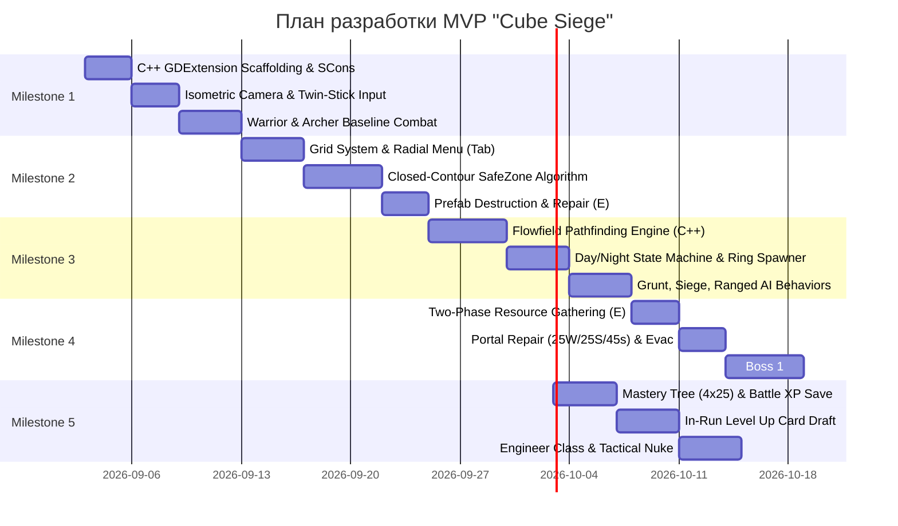

# Task Backlog: Project "Cube Siege" (Godot 4 C++ GDExtension)

> **Статус**: План спринтов и дорожная карта разработки  
> **Стек**: Godot 4.x + C++ GDExtension + GDScript UI  
> **Версия**: 1.2.0  

---

## Дорожная карта (Milestones 1–5)

---

### Milestone 1: Фундамент ядра, C++ GDExtension и Twin-Stick боевка (Graybox)
- [x] **Task 1.1**: Развертывание репозитория Godot 4 с окружением `godot-cpp` (SCons, биндинги C++ подготовлены).
- [x] **Task 1.2**: Изометрическая камера с экспоненциальным сглаживанием и упреждением взгляда (`LookAhead`).
- [x] **Task 1.3**: Базовый `CharacterBody3D` контроллер: WASD-перемещение с нормализацией вектора + поворот к курсору в плоскости $Y=0$.
- [x] **Task 1.4**: Боевой пайплайн Воина: атака мечом [ЛКМ] по сектору 90°, секторный взмах [ПКМ] 180°, рывок с i-frames [Пробел].
- [x] **Task 1.5**: Механика парирования Воина [Q]: окно 0.5с полной неуязвимости с авто-станом атакующего.
- [x] **Task 1.6**: Боевой пайплайн Лучника: стрельба стрелами [ЛКМ], сквозная стрела [ПКМ], кувырок [Пробел], приманка с аггро [Q].

### Milestone 2: Строительная сетка, SafeZone алгоритм и Префабы
- [x] **Task 2.1**: Дискретная 2D/3D сетка тайлов ($1 \times 1$ метр) с проверкой занятости и коллизий.
- [x] **Task 2.2**: 2-уровневое Радиальное меню строительства на клавишу `Tab` в реальном времени (`radial_menu.gd`).
- [x] **Task 2.3**: Алгоритм поиска 4-связных замкнутых циклов стен и заливки полигона `SafeZone` (`safe_zone_detector.gd`).
- [x] **Task 2.4**: Динамическая инвалидация безопасной зоны при разрушении хотя бы одного блока контура.
- [x] **Task 2.5**: Система взаимодействия на `[E]`: полевой ремонт поврежденных стен и снос на `[Shift + E]` с возвратом 50% ресурсов.

### Milestone 3: AI Толпы, Кольцевой спавн и Смена Фаз
- [ ] **Task 3.1**: Реализация легковесного C++ генератора `Flowfield` (Dijkstra wave front к позиции игрока) — *запланировано в Milestone 5*.
- [x] **Task 3.2**: Машина состояний Day/Night с таймерами (3 мин день со скипом / 2 мин ночь) и интеграцией с `EventBus`.
- [x] **Task 3.3**: Генератор кольцевого спавна за пределами FOV камеры с векторным смещением при препятствиях.
- [ ] **Task 3.4**: Логика разрушения одиночных стен мобами при спавне на застроенных тайлах за экраном.
- [x] **Task 3.5**: Базовый класс врагов `EnemyBase` и специфичный ИИ: Осадный крушитель (приоритет стен) и Скелет-стрелок (кайтинг на дистанции).

### Milestone 4: Экономика, Портал Эвакуации и Босс 10-й ночи
- [x] **Task 4.1**: Двухфазная механика добычи ресурсов: урон по нодам [ЛКМ] + ченнелинг сбора с земли на `[E]` (1 сек).
- [x] **Task 4.2**: Динамический компас вокруг героя со счетчиком метров до Портала и сменой цвета.
- [x] **Task 4.3**: Центральный Портал: сдача 25 дерева + 25 камня -> таймер 30/45с -> открытие -> эвакуация на `[E]` 2 сек.
- [x] **Task 4.4**: Босс 10-й ночи (Gorgon the Trampler): стейт-машина на enum, телеграфирование тарана, пробивающего стены, дросселирование миньонов.
- [x] **Task 4.5**: Награда за победу над боссом: начисление опыта и пьедестал Уникальной Реликвии.

### Milestone 5: Мета-Мастерство, Драфт карт, Оптимизация
- [x] **Task 5.1**: Локальная система сохранений с версионированием (`SAVE_VERSION = 1`), валидацией типов и Permadeath.
- [x] **Task 5.2**: Дерево Мастерства персонажа (до 100 уровней): 4 ветки (Кровожадность, Выживаемость, Проворство, Ремесло) по 25 очков.
- [x] **Task 5.3**: Внутриматчевый драфт карт (выбор 1 из 3 при левелапе из разблокированного пула).
- [x] **Task 5.4**: Ультимейт Воина [F] («Вызов на Дуэль»): авто-бег навстречу, привязка тезером, срез входящего урона на 40%, отражение 20%.
- [x] **Task 5.5**: Ультимейт Лучника [F] («Око Снайпера»): пассивная дальность +50% и сдвиг камеры.
- [x] **Task 5.6**: Инженер: базовый молот с ремонтом построек, временная турель, радиоуправляемая мина, и Ультимейт [F] («Оверклок»).
- [ ] **Task 5.7**: Перенос вычислений Flowfield и пулинга снарядов на C++ GDExtension для 500+ мобов.
