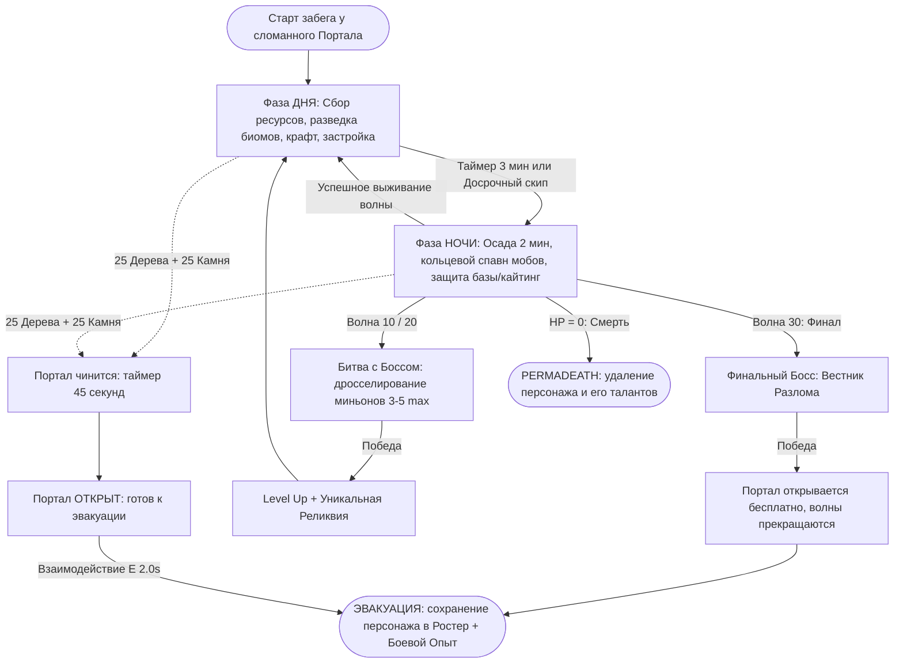

# Game Design Document (GDD): Project "Cube Siege" (Working Title)

> **Статус документа**: Утвержденная спецификация Core MVP  
> **Роли**: Game Designer / Product Owner (User), Lead Tech Specialist & Systems Architect (AI)  
> **Версия**: 1.2.0  
> **Жанр**: Isometric Survival Roguelike / Extraction Wave Defense  
> **Движок**: Godot 4.x (C++ GDExtension + GDScript UI)  

---

## 1. Vision & Высокоуровневый концепт

### 1.1. Краткое описание (Elevator Pitch)
Динамичный изометрический 3D Survival Roguelike с визуальной эстетикой в духе *Minecraft Dungeons* (стилизованные воксельно-кубические модели, выразительные текстуры, четкая геометрия). 

Игрок берет на себя управление героем, исследует радиально генерируемый мир, днем добывает ресурсы и возводит укрепления с помощью модульных префабов через двухсекционное радиальное меню, а ночью отбивает круговые осады нарастающих волн монстров и осадных чудовищ в формате скиллозависимого Twin-Stick шутера. 

В центре карты находится сломанный Портал Эвакуации. Починив его недорогими ресурсами (25 дерева + 25 камня), игрок запускает 45-секундный таймер ремонта, после чего может совершить безопасную эвакуацию, сохранив персонажа и заработав боевой опыт для долгосрочного Дерева Мастерства. В случае гибели действует бескомпромиссный Permadeath: персонаж и его таланты удаляются навсегда.

### 1.2. Ключевые столпы дизайна (Design Pillars)
1. **Свобода тактики (Action vs Defense)**: Строительство баз и ловушек полезно, но не обязательно. Опытный боец может выживать исключительно за счет позиционирования, рывков, парирований и меткости Twin-Stick управления.
2. **Дилемма жадности и времени (Risk vs Reward Logistics)**: Чем дальше игрок удаляется от центрального портала, тем богаче залежи ценных руд и магических камней. Однако ресурсы на карте не восстанавливаются, а за 30 секунд до заката путь назад становится смертельной гонкой.
3. **Осознанная эвакуация (Calculated Extraction)**: Запуск починки портала требует 45 секунд выдержки, исключая «панический побег». Решение эвакуироваться сейчас или пойти на 10/20/30 волну за босс-реликвиями — фундаментальный выбор игрока.
4. **Горизонтальное развитие без обесценивания (Evergreen Skills)**: Базовый набор умений не выбрасывается ради «высокоуровневых аналогов». Прокачка в забеге и Дерево Мастерства наделяют стартовые навыки новыми механическими свойствами и синергиями.

---

## 2. Игровой цикл (Core Gameplay Loop)

### 2.1. Фазовая динамика
| Параметр | Дневная фаза (Разведка и Подготовка) | Ночная фаза (Осада и Выживание) |
| :--- | :--- | :--- |
| **Длительность** | 180 секунд (3 минуты). | 120 секунд (2 минуты) или до победы над боссом. |
| **Управление временем** | Доступен досрочный запуск ночи (Fast-Forward). Продлить нельзя. | Фиксированный таймер. Ускорить или замедлить осаду невозможно. |
| **Угрозы** | Агрессивная фауна отсутствует. Естественные препятствия. | Кольцевой спавн волн врагов за пределами видимости экрана. |
| **Активности** | Вырубка леса, добыча камня/железа/кристаллов, застройка, крафт у Портала. | Кайтинг, позиционирование, активация спецспособностей, полевой ремонт стен, заманивание в ловушки. |
| **Строительство** | Полноценное возведение контура базы и рубежей обороны. | Экстренная установка стен-щитов, минных заграждений, тактический ремонт. |

### 2.2. Механика и экономика Портала Эвакуации (Extraction Portal)
- **Точка дислокации**: Геометрический центр карты $(0, 0)$, начальная точка спавна игрока.
- **Стоимость починки**: **25 Единиц Дерева + 25 Единиц Камня** (дешевый порог, достижимый за первые 1.5–2 минуты первого дня).
- **Таймер запуска ремонта**: **45 секунд** обратного отсчета после сдачи материалов.
  - Портал неуязвим для атак противников.
  - Игрок обязан продержаться до конца отсчета (исключает эксплойт «мгновенного побега» при смертельном зажатии толпой).
- **Статус готовности**: По истечении 45 секунд портал испускает вертикальный световой луч, а стрелка-компас окрашивается в зеленый цвет.
- **Процесс эвакуации**: Удержание клавиши `[E]` (2.0 секунды) у открытого портала. Доступно и днем, и ночью.
- **Итог эвакуации**: Все временные улучшения забега сгорают; персонаж успешно сохраняется в Ростер, получая накопленный Боевой Опыт и очки Дерева Мастерства.

---

## 3. Схема управления и камера (Twin-Stick Layout)

### 3.1. Параметры камеры
- **Перспектива**: Изометрическая проекция под фиксированным углом (наклон ~50°, поворот ~45°).
- **Слежение**: Плавный Smooth Dampening за персонажем с динамическим упреждением в сторону курсора (Look-Ahead offset).
- **Отказ от миникарты**: Чистый экран. Навигация базируется на динамическом компасе со счетчиком дистанции в метрах.

### 3.2. Назначение клавиш
- `[W][A][S][D]`: Независимое всенаправленное перемещение персонажа.
- `[Мышь Move]`: Вектор прицеливания и поворот торса/оружия.
- `[ЛКМ]`: Базовая атака (Basic Attack).
- `[ПКМ]`: Спецумение (Special Ability, AoE / Line-pierce).
- `[Пробел]`: Рывок / Уклонение (Dash, i-frames / смещение).
- `[Q]`: Классовая тактическая утилита (Parry / Decoy / Remote Mine).
- `[F]`: Ультимативная способность (Ultimate).
- `[Tab]` (Hold): 2-уровневое Радиальное меню строительства (Real-time).
- `[E]` (Hold): Контекстное взаимодействие (сбор ресурсов, починка стен, эвакуация).
- `[Shift + E]`: Демонтаж постройки с возвратом 50% материалов.

---

## 4. Классы персонажей и Боевые способности (MVP Scope)

### 4.1. Воин (Warrior) — Базовый класс со старта
*Архетип: Несокрушимый дуэлянт и танк ближнего боя.*
- **[ЛКМ] Базовая атака (Серия ударов мечом)**: Урон в секторе 90° перед собой (радиус 2.5м). Отталкивает рядовых врагов.
- **[ПКМ] Спецумение (Фронтальный рассекающий удар)**: Широкий взмах мечом по дуге ~180° с повышенным базовым уроном и сильным отбрасыванием. Кулдаун: 4 сек. *(Мутации: круговой вихрь 360°, оглушение о стену, кровотечение)*.
- **[Пробел] Боевой рывок (Combat Dash)**: Быстрое смещение на 5 метров с микро-окном неуязвимости (0.15 сек). Кулдаун: 3 сек.
- **[Q] Классовая утилита (Парирование / Parry)**:
  - Игрок принимает защитную стойку ровно на 0.5 секунды.
  - Поглощает 100% любого входящего урона (включая удары боссов и снаряды).
  - При успехе: оглушает атаковавшего врага на 1.0 сек и наносит ответный урон. Кулдаун: 6 сек (промах) / 3 сек (успех).
- **[F] Ультимейт («Вызов на Дуэль / Duel of Honor»)**:
  - Выбирает целью любого врага (включая осадных монстров и боссов).
  - Воин автоматически бежит к цели (WASD блокируется, но атаки и скиллы работают).
  - Цель бросает все текущие задачи и в ярости бежит навстречу Воину в ближний бой.
  - Воин наносит цели на +20% больше урона.
  - Входящий урон от всех сторонних мобов снижается на 40%, а 20% урона от них отражается обратно атакующим.
  - Длится бескомпромиссно до смерти одной из сторон!

### 4.2. Лучник (Archer) — Базовый класс со старта
*Архетип: Высокомобильный снайпер дальнего боя, мастер кайтинга.*
- **[ЛКМ] Базовая атака (Выстрелы из лука)**: Стрельба стрелами по направлению курсора с упреждением.
- **[ПКМ] Спецумение (Сквозная стрела / Piercing Arrow)**: Пробивает всех врагов насквозь по прямой линии через весь экран. Кулдаун: 5 сек. *(Мутации: осколочные щепы, сбивание с ног, срез брони на 30%)*.
- **[Пробел] Акробатический кувырок (Tumble)**: Кувырок на 6 метров с ускорением бега на +15% на 1 сек. Кулдаун: 3.5 сек.
- **[Q] Классовая утилита (Приманка / Decoy)**:
  - Бросает чучело в точку курсора на 3.5 секунды.
  - Перехватывает аггро всех мобов в радиусе 7м, собирая их в плотную шеренгу для выстрела Сквозной стрелой. Кулдаун: 12 сек.
- **[F] Ультимейт («Око Снайпера / Eagle Eye»)**:
  - **Пассивная способность**: Не требует нажатия.
  - Увеличивает дальность полета стрел на +50%.
  - Смещает фокус камеры вперед по направлению прицеливания (Look-Ahead), позволяя видеть и поражать цели далеко за пределами стандартного экрана.

### 4.3. Инженер (Engineer) — Открывается за 5 построек
*Архетип: Огневая поддержка, фортификация и тяжелая артиллерия.*
- **[ЛКМ] Базовая атака (Удар молотом)**: Тяжелый удар. Медленный замах, высокий урон. Удары молотом по поврежденным союзным префабам восстанавливают им прочность.
- **[ПКМ] Спецумение (Временная турель)**: Ставит автоматическую турель на 12 секунд (2 выстрела/сек по ближайшим врагам). Кулдаун: 14 сек.
- **[Пробел] Тактический отскок**: Прыжок назад на 4.5м с рассыпанием замедляющих шипов. Кулдаун: 4 сек.
- **[Q] Классовая утилита (Управляемая мина / Remote Mine)**:
  - 1-е нажатие: закладка фугаса на землю.
  - 2-е нажатие: ручной подрыв в любой момент с колоссальным AoE-уроном и оглушением на 1.5 сек. Кулдаун: 8 сек.
- **[F] Ультимейт («Орбитальный ракетный залп / Tactical Nuke»)**:
  - Целевой авиаудар ракетами в радиусе 10 метров с телеграфом 1.2 сек.
  - Сметает толпы врагов, сносит броню осадным мобам и оставляет горящий след на 5 секунд. Кулдаун: 60 сек.

---

## 5. Система строительства и Префабов

### 5.1. Радиальное меню строительства (Клавиша Tab)
- Работает в реальном времени (No Bullet Time). Удержание `Tab` открывает 4 сектора первого круга, смещение мыши выбирает префаб второго круга, отпускание `Tab` создает голограмму постройки на сетке.
- `ЛКМ` — установить постройку. `ПКМ` — отменить установку.

### 5.2. Каталог префабов
1. **Стены**:
   - Деревянный частокол (4 Дерева, 250 HP).
   - Каменная стена (4 Камня, 750 HP).
   - Железная шипованная стена (2 Камня + 2 Железа, 1200 HP, возврат 25% урона).
2. **Ловушки**:
   - Напольные шипы (2 Дерева + 1 Камень, периодический урон).
   - Смоляная яма (2 Дерева + 1 Маг. камень, замедление 50%).
   - Фугасная нажимная плита (1 Камень + 2 Железа, 300 разового AoE урона).
3. **Башни**:
   - Луковая вышка (6 Дерева + 2 Камня, автострельба 1 выстр/сек).
   - Тяжелая баллиста (4 Камня + 4 Железа, тяжелые пробивающие болты).
   - Магический обелиск (4 Камня + 3 Маг. камня, цепная молния на 4 цели).
4. **Утилити**:
   - Ремонтный маяк (3 Камня + 2 Железа, аура ремонта 15 HP/сек).
   - Сигнальный фонарь (2 Дерева + 1 Маг. камень, подсветка и +10% крит-шанс).
   - Магнитный сборщик (2 Железа + 2 Маг. камня, притягивает лут в радиусе 8м).

### 5.3. Механика безопасных зон (Closed Contour Safe Zone)
- Непрерывный замкнутый контур стен помечает внутреннюю территорию базы тегом `SafeZone`.
- Внутри `SafeZone` мобы не спавнятся, даже если база находится за пределами экрана.
- Если осадный моб пробивает хотя бы один блок стены — контур размыкается, и спавн снова разрешен.

---

## 6. Экономика, Сбор и Верстак

1. **Ресурсы**: Дерево, Камень, Железо, Магические камни, Дроп с мобов, Трофеи (накопительный урон по типам врагов). Счетчики безлимитные, без веса и слотов инвентаря.
2. **Двухфазная добыча**:
   - Фаза 1: Разрушение ноды (дерево/валун/жила) атаками на ЛКМ или скиллами.
   - Фаза 2: Сбор материалов с земли удержанием клавиши `[E]` (1.0 секунда ченнелинга).
   - Ресурсы на карте **не возрождаются** со временем, стимулируя расширение радиуса вылазок.
3. **Верстак у Портала**:
   - 3 слота экипировки: Оружие, Броня, Обувь (крафт за железо и камни).
   - 2 слота Реликвий: выбиваются исключительно с Боссов 10 и 20 волн.
   - Утилизация (Salvage): Разбор ненужных вещей и лишнего дропа мобов в стройматериалы в 1 клик.

---

## 7. Прогрессия: Мета-Мастерство и Драфт карт

1. **Дерево Мастерства (до 100 уровней на персонажа)**:
   - Ветка «Кровожадность» (25 уровней): Урон, скорость атаки, мутации кровотечений и сплэша.
   - Ветка «Выживаемость» (25 уровней): Здоровье, защита, мутации вампиризма и щитов.
   - Ветка «Проворство» (25 уровней): Скорость бега, перезарядки, вторые заряды умений.
   - Ветка «Ремесло» (25 уровней): Скорость сбора (E), прочность стен, авторемонт.
2. **Внутриматчевый драфт**:
   - Опыт дается за убийства мобов (10-20 XP), добычу нод (3-5 XP) и постройку префабов (~1 XP).
   - При Level Up игрок выбирает 1 из 3 случайных карт из пула, разблокированного его Деревом Мастерства.
3. **Permadeath**:
   - Смерть в забеге безвозвратно удаляет персонажа и его накопленный боевой опыт.
   - Успешная эвакуация через Портал сохраняет персонажа в ростер и начисляет очки Мастерства.

---

## 8. Бестиарий и Боссы

1. **Рядовые мобы**:
   - *Мили-гуль*: Массовое пушечное мясо, преследование по Flowfield.
   - *Осадный крушитель*: Целенаправленный снос стен и турелей утроенным уроном.
   - *Скелет-стрелок*: Кайтинг на дистанции 7м, навесная стрельба из-за спин пехоты.
2. **Боссы (Акты I, II, III)**:
   - Спавн рядовых мобов дросселируется до 3–5 штук max.
   - **Ночь 10 (Gorgon the Trampler)**: Таран с пробитием стен, секторная ударная волна. Награда: Level Up + Реликвия I.
   - **Ночь 20 (Mortar Colossus)**: Осадная артиллерия через преграды, призыв щитоносцев. Награда: Level Up + Реликвия II.
   - **Ночь 30 (Rift Harbinger - Финал)**: Гравитационные воронки, веерные лучевые залпы, телепортация. Победа останавливает волны и автоматически активирует Портал с победным триумфом.
