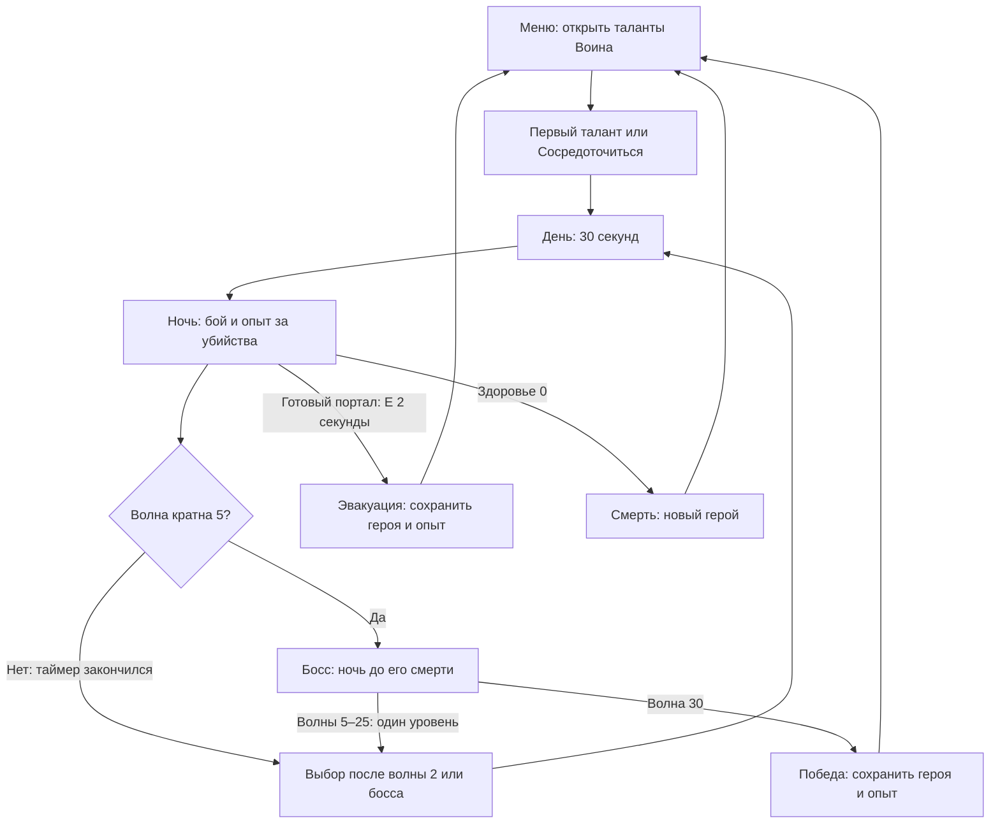

# Game Design Document (GDD): Project "Cube Siege" (Working Title)

> **Статус документа**: Спецификация первой версии Воина, редакция пользователя 2026-10-03
> **Роли**: Game Designer / Product Owner (User), Lead Tech Specialist & Systems Architect (AI)
> **Версия**: 1.3.0
> **Жанр**: Isometric Survival Roguelike / Extraction Wave Defense
> **Движок**: Godot 4.x (основная логика GDScript, утверждённая производительность — C++ GDExtension)

---

## 1. Vision и рамки первой версии

Изометрический 3D Survival Roguelike / Extraction Wave Defense с воксельной эстетикой в направлении *Minecraft Dungeons*. Первый законченный цикл строится вокруг **одного Воина**: бой, 30 волн, шесть боссов, таланты, специализации и открытие дерева между забегами.

Игрок исследует процедурный мир, собирает ресурсы, при желании использует существующее строительство и переживает ночные атаки. Портал в центре позволяет закончить забег, сохранить персонажа и получить опыт для открытия талантов. Враги портал не атакуют. Смерть удаляет прогресс конкретного героя; эвакуация и победа сохраняют его дерево.

Столпы: управляемый бой с читаемыми атаками и позиционированием; осознанная эвакуация; разные билды одного класса; разделение постоянного открытия и временного выбора механик.

**Первая версия:** Воин, девять талантов и три синергии, 30 волн, боссы каждые пять волн, элитные монстры после волны 5, сохранения и продолжение тем же героем после победы.

**Отложены:** игровые ветки Лучника и Инженера, вещи/экипировка, атрибуты, деревня и обучение. Их старые прототипы не являются критерием завершения первой версии; данные классов сохраняются.

Целевой темп: полное прохождение **2–3 часа** через несколько забегов; ранние **3–10 минут**, средние **10–20**, финальный **40–45**. Открытие дерева целится в **8–15 успешных эвакуаций**; победить можно раньше. Это цели балансировки, **не подтверждённые длительным playtest**. Пользователь 2026-10-03 делегировал агенту оставшиеся числа и идеи в этих границах.

## 2. Игровой цикл

```mermaid
flowchart TD
    Menu[Меню: открыть таланты Воина] --> Build[Первый талант или Сосредоточиться]
    Build --> Day[День: 30 секунд]
    Day --> Night[Ночь: бой и опыт за убийства]
    Night --> Boss{Волна кратна 5?}
    Boss -->|Нет: таймер закончился| Reward[Выбор после волны 2 или босса]
    Boss -->|Да| Fight[Босс: ночь до его смерти]
    Fight -->|Волны 5–25: один уровень| Reward
    Reward --> Day
    Fight -->|Волна 30| Win[Победа: сохранить героя и опыт]
    Night -->|Готовый портал: E 2 секунды| Extract[Эвакуация: сохранить героя и опыт]
    Night -->|Здоровье 0| Death[Смерть: новый герой]
    Win --> Menu
    Extract --> Menu
    Death --> Menu
```

### 2.1. Время и волны

| Параметр | Первая версия |
| :--- | :--- |
| День | **30 секунд**, можно досрочно запустить ночь |
| Обычная ночь | **min(120, 20 + 2 × номер волны) секунд**: первая 22 с, волна 29 — 78 с |
| Босс | На волнах **5, 10, 15, 20, 25, 30** ночь не заканчивается, пока босс жив |
| Рассвет | Оставшиеся монстры удаляются без опыта/награды за убийство |
| Финал | После босса 30 прекращается бой, герой сохраняется и доступен возврат в меню |

24 обычные ночи занимают 20 минут, 30 полных дней — 15. Время шести боссов, решений по билду и пропуск дня меняют фактическую длительность. Это стартовая настройка под финальный забег 40–45 минут.

### 2.2. Портал

Центр карты и старт героя. Починка: **25 дерева + 25 камня**, затем **45 секунд** ожидания. Портал неуязвим; враги его не выбирают целью. Эвакуация удержанием **[E] 2 секунды** доступна днём и ночью.

Портал сообщает намерение эвакуироваться; единственный координатор записывает исход, исключая двойное начисление. Опыт: `80 + 60 × (уровень − 1) + 2 × собранные единицы ресурсов`. Считается добыча за забег, независимо от последующих расходов. Ошибка записи оставляет бой остановленным и позволяет повторить сохранение того же исхода; победа остаётся победой.

---

## 3. Схема управления и камера (Twin-Stick Layout)

### 3.1. Параметры камеры
- **Перспектива**: Изометрическая проекция под строго фиксированным углом (поворот ~45°, наклон ~43.3° / pitch ~-43.3°, yaw 45°, roll 0°, FOV 45°). Rotation и FOV камеры неизменны во время игрового процесса и не зависят от движения курсора, персонажа или выбранного пресета.
- **Слежение за героем**: Плавное сглаженное следование (Smooth Dampening) за персонажем. В центральной зоне экрана (70% ширины и 70% высоты viewport) обычное прицеливание мышью не создает смещения камеры.
- **Периферийное смещение (Edge Pan)**: При подведении курсора к внешним 15% viewport камера плавно и непрерывно смещается в направлении обзора на игровой плоскости (до 4.0 м). Герой всегда остается в кадре, возврат в центральную область возвращает камеру к персонажу.
- **Дальность камеры**: В настройках доступны три фиксированных пресета:
  - *Близко* (`Vector3(12, 16, 12)`);
  - *Средне* (`Vector3(15, 20, 15)`) — значение по умолчанию;
  - *Далеко* (`Vector3(18, 24, 18)`).
  Смена пресета применяется плавно на лету и сохраняется между запусками.
- **Отказ от миникарты**: Чистый экран. Навигация базируется на динамическом компасе со счетчиком дистанции в метрах.

### 3.2. Назначение клавиш
- `[W][A][S][D]`:
  - **Базовое перемещение (Default Locomotion)**: Движение строго относительно экрана (Screen-Relative / изометрическая плоскость камеры): `[W]` — вверх по экрану (вперед по изометрии), `[S]` — вниз по экрану (назад по изометрии), `[A]` / `[D]` — влево / вправо по экрану.
  - **Специальный контракт цели (`forced_target`)**: При наличии валидной принудительной цели (`forced_target != null`) сохраняется специальное правило — базис ручного WASD-движения переключается на относительный вектор к цели (`[W]` к цели, `[S]` от цели, `[A]`/`[D]` орбитальный стрейф вокруг цели).
  - **Перехват движения Дуэлью (Duel Override)**: В режиме «Дуэль» Воина (`is_dueling == true`) ручное перемещение WASD отключается, а локомоция полностью перехватывается автоматическим контроллером дуэли (`process_duel_movement`), стягивающим героя к оппоненту.
- `[Мышь Move]`: Вектор прицеливания (`AimDirection`), поворот торса/оружия, наведение атак и выбор целей способностей. В обычном режиме не влияет на экранный базис WASD.
- `[ЛКМ]`: Базовая атака (Basic Attack).
- `[ПКМ]`: Спецумение (Special Ability, AoE / Line-pierce).
- `[Пробел]`: Рывок / Уклонение (Dash, мобильное смещение по вектору относительного движения при зажатом WASD или по направлению взгляда/корпуса; правила неуязвимости i-frames зависят от класса: базово активны у Лучника и Инженера, у Воина базовая неуязвимость отключена и вынесена в таланты).
- `[Q]`: Классовая тактическая утилита (Parry / Decoy / Remote Mine).
- `[F]`: Ультимативная способность (Ultimate).
- `[Tab]` (Hold): 2-уровневое Радиальное меню строительства (Real-time).
- `[E]` (Hold): Контекстное взаимодействие (сбор ресурсов, починка стен, эвакуация).
- `[Shift + E]`: Демонтаж постройки с возвратом 50% материалов.

---

## 4. Персонаж первой версии: Воин

*Дуэлянт ближнего боя с развитием в агрессию, восстановление или мобильность.*

| Клавиша | Базовая способность |
| :--- | :--- |
| ЛКМ | Меч по одной цели в секторе. «Разящий удар» добавляет все цели сектора. |
| ПКМ | Фронтальное Рассечение с подготовкой и показанной областью. Таланты добавляют выпад и круговую форму. |
| Пробел | Рывок с учётом столкновений, без базовой неуязвимости. «Идеальный рывок» даёт её и удваивает дистанцию. |
| Q | Парирование одного первого удара. «Контратака» продлевает окно, парирует все удары и наносит ответный урон. |
| F | Дуэль до смерти одной стороны: автоматическое сближение, бонус урона по цели, защита от сторонних врагов и отражение части их фактического урона. |

Босса нельзя оглушить или прервать подготовку атаки. Вампиризм работает только от фактического урона здоровью; отражение его не активирует. Щит блокирует весь удар без переноса избытка в HP; отражение использует фактическую потерю щита или HP. Независимые замедления сочетаются как `1 − (1 − s1) × (1 − s2) × …`.

Числа талантов и рецепты: [`warrior_radial_talent_tree_concept.md`](design/warrior_radial_talent_tree_concept.md). Боевые эффекты также доступны в [`ABILITY_LAB.md`](ABILITY_LAB.md).

Лучник и Инженер остаются прототипами в коде и старых сохранениях; их запуск из меню отключён в первой версии.

---

## 5. Система строительства и Префабов

### 5.1. Радиальное меню строительства (Клавиша Tab)
- Работает в реальном времени (No Bullet Time). Удержание `Tab` открывает 4 сектора первого круга, смещение мыши выбирает префаб второго круга, отпускание `Tab` создает голограмму постройки на сетке.
- `ЛКМ` — установить постройку. `ПКМ` — отменить установку.

### 5.2. Каталог префабов
1. **Стены**:
   - Деревянный частокол (4 Дерева, 250 HP).
   - Каменная стена (4 Камня, 750 HP).
   - Железная шипованная стена (2 Камня + 2 Железа, 1200 HP, возврат 25% урона).
2. **Ловушки**:
   - Напольные шипы (2 Дерева + 1 Камень, периодический урон).
   - Смоляная яма (2 Дерева + 1 Маг. камень, замедление 50%).
   - Фугасная нажимная плита (1 Камень + 2 Железа, 300 разового AoE урона).
3. **Башни**:
   - Луковая вышка (6 Дерева + 2 Камня, автострельба 1 выстр/сек).
   - Тяжелая баллиста (4 Камня + 4 Железа, тяжелые пробивающие болты).
   - Магический обелиск (4 Камня + 3 Маг. камня, цепная молния на 4 цели).
4. **Утилити**:
   - Ремонтный маяк (3 Камня + 2 Железа, аура ремонта 15 HP/сек).
   - Сигнальный фонарь (2 Дерева + 1 Маг. камень, подсветка и +10% крит-шанс).
   - Магнитный сборщик (2 Железа + 2 Маг. камня, притягивает лут в радиусе 8м).

### 5.3. Механика безопасных зон (Closed Contour Safe Zone)
- Непрерывный замкнутый контур стен помечает внутреннюю территорию базы тегом `SafeZone`.
- Внутри `SafeZone` мобы не спавнятся, даже если база находится за пределами экрана.
- Если осадный моб пробивает хотя бы один блок стены — контур размыкается, и спавн снова разрешен.

---

## 6. Экономика и сбор

Ресурсы забега: дерево, камень, железо и магические камни. Кошелёк без веса и слотов; материалы используются для портала и существующего строительства. Полнотелая нода разрушается атакой, затем материалы собираются удержанием [E]; свободные пикапы собираются напрямую. Собранные ресурсы не возрождаются при загрузке чанка. Для опыта эвакуации считается фактическая добыча героя, без вычитания расходов.

Вещи, экипировка, реликвии и атрибуты **не реализуются в первой версии**. Верстак со старым крафтом/мастерством убран из живой сцены; прототипы остаются для совместимости.

## 7. Прогрессия

### 7.1. Между забегами

У нового Воина открыты три таланта первого круга. Шесть талантов второго круга стоят по **1000 и 1400 XP** на ветку, суммарно **7200 XP**.

Каждый открытый талант, включая стартовые, независимо от выбора в забеге даёт:

| Ветка | Бонус за талант |
| :--- | :--- |
| Кровожадность | **+3% урона обычной атаки**, без усиления базового урона других способностей |
| Выносливость / выживаемость | **+5 максимального HP** |
| Манёвренность | **+2% скорости бега** |

Покупка только между забегами, принадлежит персонажу, не имеет повторных рангов и сохраняется атомарно. Старое глобальное Мастерство не добавляется к бонусам Воина.

### 7.2. В забеге

- Максимум **6 талантов**. Первый выбор до волны 1, второй после волны 2, следующие после боссов до заполнения слотов. Босс 30 завершает игру без выбора.
- До **3 уникальных** случайных открытых талантов, без переброса. «Сосредоточиться» даёт **2 очка специализации**.
- Уровень за убийства монстров: первый порог 80 XP, следующие на 20 выше. Каждый уровень — **1 очко специализации**.
- Босс даёт **ровно 1 уровень**, без дополнительного XP и вещей.
- Специализации усиливают свойства способностей; **ранги не ограничены**, **перераспределение бесплатно в любой момент**.
- Большинство множителей: `1 + 0.08 × ранг`; радиус Рассечения: `1 + 0.05 × ранг`; перезарядка/интервал атак: `1 / (1 + 0.08 × ранг)`.
- Пара выбранных талантов автоматически раскрывает синергию. Она не занимает слот и заранее скрыта.

Полный контракт: [`in_run_progression_concept.md`](design/in_run_progression_concept.md). Настоящая игровая сцена прошла ускоренную интеграционную проверку 30 волн/6 боссов (95 проверок) и GPU UI захват (99 проверок), включая немедленное удаление владельца удара и перезагрузку победителя. Фактические свидетельства и ограничения: [`STATUS.md`](STATUS.md).

### 7.3. Исходы и сохранение

Эвакуация и победа сохраняют героя, открытое дерево и опыт; новый забег начинается с чистым временным билдом. После победы можно снова играть тем же героем без повторного открытия дерева. Смерть заменяет его новым Воином со стартовыми тремя талантами; история сохраняется.

Схема **v3** хранит прогресс Воина в его слоте. Миграция старой прокачки выполняется один раз, с компенсацией в опыт талантов; другие классы и история сохраняются. Покупка откатывается при ошибке записи. Исход записывается единственным владельцем транзакции и безопасно повторяется после ошибки.

## 8. Монстры и боссы

Обычные враги: ближний боец, стрелок, осадный крушитель. Состав, темп и лимит растут с волной. Элитные варианты появляются **после волны 5**. При живом боссе одновременно не больше четырёх обычных врагов.

| Волна | Босс |
| ---: | :--- |
| 5 | Страж кургана |
| 10 | Горгон-Топтатель |
| 15 | Пепельный оракул |
| 20 | Мортирный колосс |
| 25 | Страж Разлома |
| 30 | Вестник Разлома |

Собственные модели, анимации и VFX. У ранних боссов 2–3 читаемые атаки со скиллчеками вместо контактной атаки. Далее сокращается подготовка, растут скорость атак и урон; последние два имеют несколько стадий. Телеграф показывает область и момент попадания; отдельные атаки накладывают замедление. Подготовка не прерывается оглушением. Ночь длится до смерти босса; награда — один уровень. Финальный босс завершает игру и сохраняет героя.

Подробности и проверка: [`BOSS_ENCOUNTERS.md`](BOSS_ENCOUNTERS.md).

---

## 9. Процедурный мир, биомы и вертикальность

### 9.1. Макро-биомы и структура мира
- **Центральная зона безопасности**: Портал дислоцирован на плоской платформе (радиус 6.5м) на высоте 0 блоков.
- **3 макро-сектора биомов**:
  - **Лес (Forest)**: Перепад высот 0..+10 блоков. Пологие холмы, высокая плотность дубов (85% дерево, 14% камень, 1% железо). Кроны деревьев переходят в полупрозрачный режим при перекрытии камеры.
  - **Равнина (Plains)**: Перепад высот 0..+4 блока. Открытые просторы, локальные неровности, декоративная трава (68% пусто/трава), редкие деревья (20%), валуны (10%) и редкий Магический камень (2%).
  - **Горы (Mountains)**: Масштабируются без низкого потолка в глубину сектора, достигая высот 50+ и 100+ блоков. У границ с Лесом и Равниной высота плавно опускается до уровня соседей через кубическое затухание, исключая искусственные вертикальные стены на стыках биомов.
  - **Гарантированная горная тропа**: Авторитетный коридор подъема (`is_mountain_trail`), обеспечивающий непрерывную цепочку ступеней `|Δheight| <= 1` от Портала (0м) к высотам 50+ и 100+ без перекрытия непроходимыми месторождениями.
  - **Плавные границы**: Границы секторов искривлены процедурным шумом (Warping) для устранения прямых радиальных линий, со стохастическим дизерингом материалов и блендингом вероятностей ресурсов.

### 9.2. Правило ступеней и навигация
- **Ступени `|Δheight| <= 1`**: Проходимы. Юниты и герой свободно поднимаются и спускаются без прыжка (механика ступеней/лестниц).
- **Стены и обрывы `|Δheight| >= 2`**: Непроходимы для шага и для рывка (Dash). Служат естественными тактическими барьерами.

### 9.3. Вертикальный бой и траектории снарядов
- **Ближний бой**: Атака поражает цели с разницей высоты `|Δy| <= 1.0` либо распространяется по непрерывной цепи ступеней (каждый шаг `|Δy| <= 1.0`). Обрыв или уступ в 2+ блока блокирует попадание.
- **Снаряды**: При движении вдоль склона плавно поднимаются (+1) или спускаются (-1). При встрече уступа `>= +2` блока снаряд разбивается о породу. При вылете над обрывом `>= 2` блока снаряд продолжает полет по горизонтали без ныряния вниз.
- **Режимы способностей**: Наземные атаки (мечи, стрелы) зависят от связности рельефа (`TERRAIN_DEPENDENT`). Орбитальные и площадные удары (например, Тактический ядерный удар Инженера) действуют по горизонтальному радиусу на 3D-поверхность независимо от перепада высоты (`TERRAIN_INDEPENDENT`).

### 9.4. Ресурсная модель
- **Матрица вероятностей генерации ресурсов**:
  | Биом / Зона | Дерево | Камень | Железо | Магический камень | Пусто / Трава |
  | :--- | :---: | :---: | :---: | :---: | :---: |
  | **Лес** | 85% | 14% | 1% | 0% | 0% |
  | **Равнина** | 20% | 10% | 0% | 2% | 68% |
  | **Низкие горы (< 50)** | 5% | 80% | 3% | 0% | 12% |
  | **Высокие горы (>= 50)** | 2% | 80% | 15% | 0% | 3% |
- **Свободные пикапы (1-3 ед.)**: Ветви, галька, самородки и кристаллы. Размещены на слое сенсора (слой 4, bit 3: 8), не блокируют движение, собираются быстро по [E] без боя.
- **Полнотелые месторождения**: Деревья (дубы нескольких визуальных типов, в горах только молодые деревья и кустарники), жилы камня и железа (малые, средние, крупные) со стадиями визуального раскалывания при 66% и 33% HP.
- **Магический камень**: Ран-ресурс, встречается исключительно в виде свободных пикапов (1-3 ед.) на Равнине (2% вероятность), отображается в HUD и сохраняется в кошельке забега.
- **Персистентность добычи**: Срубленные и собранные ресурсы сохраняются в реестре карты и не возрождаются при выгрузке и повторной загрузке чанков.

