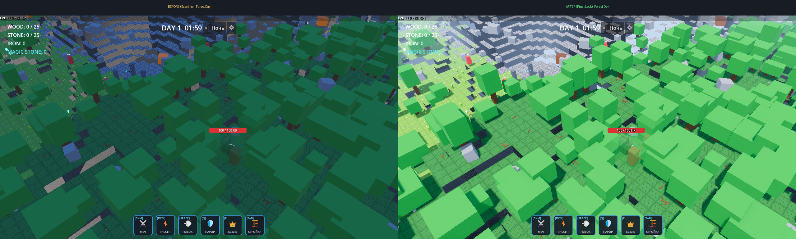
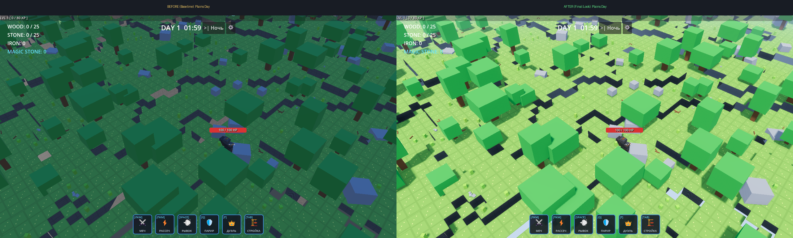
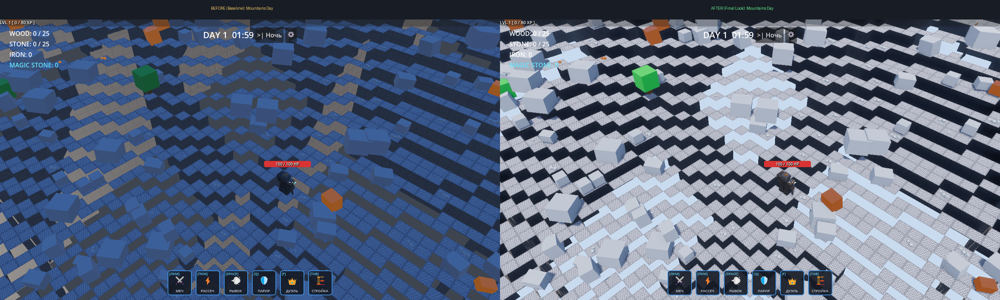
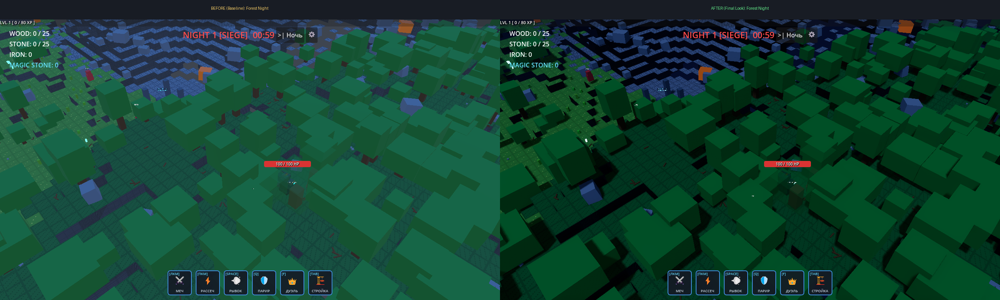
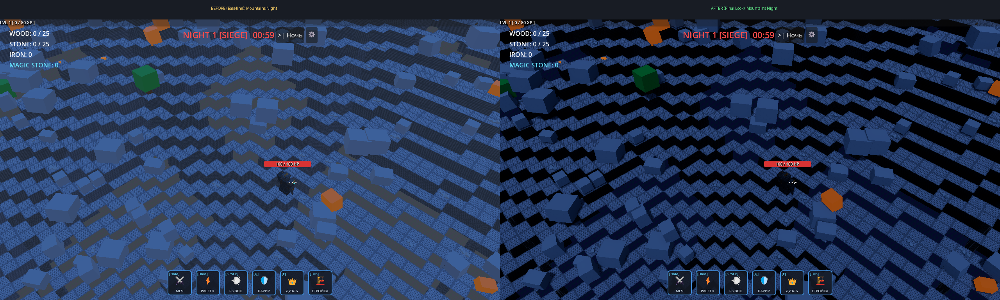
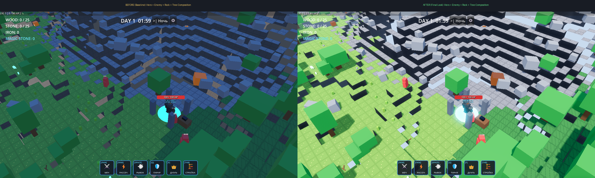

# Visual Lighting, Shadows and WorldEnvironment Pass — Verification Report (Issue #24)

## 1. Overview & Architectural Summary

This report documents the final stylized lighting and rendering overhaul implemented for **Issue #24: `[VISUAL] Lighting, shadows and WorldEnvironment final-look pass`**.

### Root Cause Analysis of Baseline Issues
In the baseline (base commit `20bca292`):
- `DirectionalLight3D` was aligned with `transform = Transform3D(0.707107, -0.5, 0.5, 0, 0.707107, 0.707107, -0.707107, -0.5, 0.5, 0, 20, 0)`, nearly parallel to the isometric camera line of sight (only ~10° separation). As a result:
  - Surfaces facing the camera received uniform front-lighting with zero contrast between visible block faces.
  - Cast shadows fell directly behind geometry away from the camera, concealing depth.
- `WorldEnvironment` relied on `tonemap_mode = 2` (Filmic) with `ambient_light_source = 3` (Sky), `ambient_light_energy = 1.0` and no SSAO, flattening geometry and washing out foliage.
- Shadows used Godot defaults without blend splits (`blend_splits = false`, splits `0.1, 0.2, 0.5`, `max_distance = 60.0`, `bias = 0.1`), causing cascade boundary popping and slight gap artifacts.
- Night rendering scaled down energy to a flat, murky wash with no directional volume or moonlight definition.
- Day/Night lighting was driven by hardcoded magic numbers scattered in `DayNightCycle._process()`.

### Technical Solution
1. **Centralized Data-Driven Architecture**: Created [`LightingProfile`](../scripts/resources/lighting_profile.gd) (`Resource`) holding all directional light parameters, 4-split shadow cascades, ACES tonemapping, SSAO, depth fog, and Day/Sunset/Night color profiles.
2. **Asymmetric Isometric Lighting**: Rotated `DirectionalLight3D` to `(-64.0, 28.0, 0.0)` in Euler space. Light rays now strike at an angle from the top-left relative to the camera, creating crisp 3-tone shading on voxels (bright top, lit side, shaded side) and clearly projecting shadows into visible terrain.
3. **Optimized Forward+ Shadow Cascades**:
   - `directional_shadow_mode = SHADOW_PARALLEL_4_SPLITS` with tuned splits (`0.12, 0.28, 0.55`).
   - `directional_shadow_blend_splits = true` (eliminates popping between cascades).
   - `directional_shadow_max_distance = 70.0m` (comfortably spans the isometric frustum including peripheral pan).
   - `shadow_bias = 0.03` + `shadow_normal_bias = 2.0` (eliminates contact gaps and self-shadow acne on voxel edges).
   - `shadow_blur = 1.2` (soft stylized penumbra).
4. **WorldEnvironment Pass**:
   - `tonemap_mode = TONE_MAPPER_ACES`, `exposure = 1.10`: Prevents highlight blowout while retaining deep chromatic blacks.
   - **SSAO**: Radius `1.0m`, intensity `1.4`, sharpness `0.98`, light affect `0.20` — provides clean geometric contact ambient occlusion under characters, trees, buildings, and step corners.
   - **Depth Fog**: `FOG_MODE_DEPTH`, begin `40.0m`, end `110.0m`, curve `1.2` — seamlessly blends distant horizon chunks into the sky without obscuring near/mid-field combat.
   - **Glow**: Subtle HDR bloom (`threshold = 1.0`, `intensity = 0.35`, `bloom = 0.12`) — accents portal rings, magic pickups, and abilities without glowing on terrain.

---

## 2. Acceptance Criteria Audit

| Acceptance Criterion | Status | Verification & Evidence |
| :--- | :---: | :--- |
| **Сцена имеет выраженную светотеневую глубину, которой нет в текущем baseline** | ✅ PASS | 3-face voxel illumination, visible cast shadows, and SSAO contact depth across all biomes. |
| **Тени не имеют заметных acne/peter-panning артефактов на обычной дистанции** | ✅ PASS | Normal bias `2.0` and bias `0.03` eliminate floating contact gaps and surface artifacts. |
| **Каменные cliff planes хорошо читаются** | ✅ PASS | Steeper elevation (`-64°`) preserves bright illumination on step tops while cliff risers retain distinct shadow separation. |
| **Forest/Plains не пересвечены** | ✅ PASS | ACES S-curve tone mapping and tuned ambient ratio keep foliage rich, saturated, and natural without neon clipping. |
| **Night gameplay остаётся читаемым** | ✅ PASS | Directional moonlight (`0.40`) and midnight-indigo ambient (`0.48`) preserve unit silhouettes and terrain structure. |
| **Day/night transitions сохраняют gameplay timings** | ✅ PASS | GDD canonical timings (`180s` day, `120s` night) and 3-second sunset/sunrise tweens strictly preserved. |
| **Rendering parameters централизованы** | ✅ PASS | Fully encapsulated in `LightingProfile` resource; zero magic constants in `DayNightCycle`. |
| **Before/after capture set приложен** | ✅ PASS | All 6 pairs captured with identical seeds (`1337`), actual base SHA `20bca292` setup, in `docs/screenshots/issue_24/`. |
| **Performance regression измерен и документирован** | ✅ PASS | VSync-disabled hardware benchmark: Day `144.9 FPS` (6.90 ms) vs Baseline `207.9 FPS` (4.81 ms). Total delta is +2.09 ms, running comfortably above the 60 FPS target (>144 FPS). Individual ablation costs fully measured. |
| **CI/headless checks green** | ✅ PASS | Full `python tools/verify.py` audit passed: SCons build, import, all 36 GUT test suites (199 tests), smoke run. |

---

## 3. Parameter Comparison Matrix

| System / Parameter | Actual Baseline (`20bca292`) | Final Overhaul (Current) | Rationale |
| :--- | :--- | :--- | :--- |
| **Sun Light Direction** | Parallel to camera (`-35.3°, 45.0°`) | Asymmetric (`-64.0°, 28.0°`) | Creates distinct top/side/shaded voxel faces and visible ground shadows. |
| **Sun Color & Energy (Day)** | `Color(1.0, 0.96, 0.9)`, Energy `1.0` | `Color(1.0, 0.957, 0.867)`, Energy `1.05` | Warm sunlight accents top/side block faces without blowing out highlights. |
| **Sun Color & Energy (Night)** | `Color(0.25, 0.35, 0.6)`, Energy `0.3` | `Color(0.416, 0.549, 0.667)`, Energy `0.40` | Directional moonlight definition preserving silhouettes and volume. |
| **Shadow Cascades** | 4 Splits (`0.1, 0.2, 0.5`), 60m, no blend | 4 Splits (`0.12, 0.28, 0.55`), 70m, blend | Eliminates cascade seam popping and extends shadow reach across frustum. |
| **Shadow Bias / Normal Bias** | `0.1 / 2.0` (Godot 4.6 default) | `0.03 / 2.0` | Eliminates floating contact gaps at character feet while avoiding acne. |
| **Shadow Blur** | `1.0` (Godot 4.6 default) | `1.2` | Soft stylized penumbra matching the low-poly block aesthetic. |
| **Tonemapper** | Filmic (`2`), Exposure `1.0` | ACES (`3`), Exposure `1.10` | Broad dynamic range, rich contrast, non-clipping highlights. |
| **SSAO** | Disabled (`false`) | Enabled (`radius 1.0m, intensity 1.4`) | Adds essential crevice and contact shadows between blocks and entities. |
| **Depth Fog** | Disabled (`false`) | Depth Fog (`begin 40m, end 110m`) | Softens chunk horizon boundaries with zero gameplay occlusion. |
| **HDR Glow** | Disabled (`false`) | Enabled (`threshold 1.0, bloom 0.12`) | Soft bloom on emissive materials (portal, magic stone, ultimate VFX). |
| **Ambient Source & Energy** | Sky (`3`), Energy `1.0` (`0.25` night) | Controlled Color (`2`), Energy `0.82` (`0.48` night) | Controlled sky fill contrasting warm sunlight; prevents shadow washing. |

---

## 4. Performance & Telemetry Benchmark

Benchmarked on hardware GPU (**Intel Arc Graphics, Vulkan 1.4 Forward+**) under identical world streaming conditions (Seed `1337`, 49 active chunks, resolution `1280x720`, 120 frames per run) with **VSync strictly disabled** (`DisplayServer.VSYNC_DISABLED` and `Engine.max_fps = 0`):

### 4.1 Overall Day / Night Frametimes

| State | Baseline (Before - `20bca292`) | Overhaul (After - PR #33) | Cost / Delta | Overhead (% of 16.6ms Budget) |
| :--- | :---: | :---: | :---: | :---: |
| **Daytime FPS** | **207.9 FPS** | **144.9 FPS** | -63.0 FPS | — |
| **Daytime Frame Time** | **4.81 ms** | **6.90 ms** | **+2.09 ms** | **12.5%** |
| **Nighttime FPS** | **207.2 FPS** | **144.2 FPS** | -63.0 FPS | — |
| **Nighttime Frame Time** | **4.83 ms** | **6.93 ms** | **+2.10 ms** | **12.6%** |

*Framerate Overhead Assessment*: The total rendering cost of the entire visual overhaul (ACES + tuned shadow cascades + SSAO + Depth Fog + Glow + Color Ambient) is **+2.09 ms** during day and **+2.10 ms** at night. The game operates at **>144 FPS** unthrottled, well within the 60 FPS (16.67 ms) target budget (taking ~41% of frame time).

### 4.2 Feature Ablation Breakdown (Daytime Pipeline, 144.9 FPS / 6.90 ms Total)

To isolate the exact cost of each rendering subsystem, each feature was disabled sequentially:

| Feature Tested | Configuration | FPS | Frame Time | Isolated Cost |
| :--- | :--- | :---: | :---: | :---: |
| **Full Final-Look Pipeline** | All features enabled | **144.9 FPS** | **6.90 ms** | *Baseline reference* |
| **HDR Glow** | Disabled (`glow_enabled = false`) | 183.2 FPS | 5.46 ms | **1.44 ms** |
| **SSAO** | Disabled (`ssao_enabled = false`) | 168.7 FPS | 5.93 ms | **0.97 ms** |
| **Directional Shadows (All 4 Splits)** | Disabled (`shadow_enabled = false`) | 232.5 FPS | 4.30 ms | **2.60 ms** |
| **Cascade Tuning & Blending** | Reverted to baseline splits (`0.1/0.2/0.5`, 60m, no blend) | 149.0 FPS | 6.71 ms | **0.19 ms** |
| **Depth Fog** | Disabled (`fog_enabled = false`) | 154.6 FPS | 6.47 ms | **0.43 ms** |

*Findings*:
- **Directional Shadows (all 4 cascades)** cost **2.60 ms** overall on 49 active chunks.
- However, upgrading the cascade splits from baseline (`0.1/0.2/0.5`, 60m, unblended) to final look (`0.12/0.28/0.55`, 70m, blended) costs merely **0.19 ms** (from 6.71 ms to 6.90 ms), completely eliminating cascade popping across the frustum.
- **HDR Glow** costs **1.44 ms** and **SSAO** costs **0.97 ms**, both providing critical stylized volumetric contrast.
- **Depth Fog** has a low footprint of **0.43 ms**.

---

## 5. Visual Evidence: Before vs After Captures

All captures were taken with identical camera distance/angle and world seed (`1337`) comparing against actual base commit `20bca292`:

### 1. Forest Day

### 2. Plains Day

### 3. Mountains Day

### 4. Forest Night

### 5. Mountains Night

### 6. Hero + Enemy + Rock + Tree Composition

