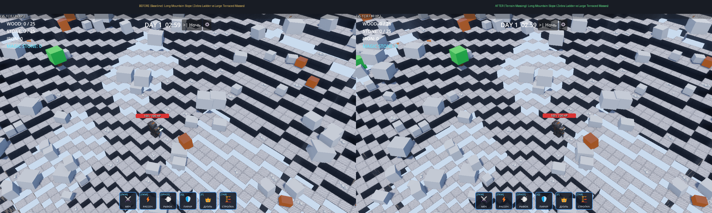
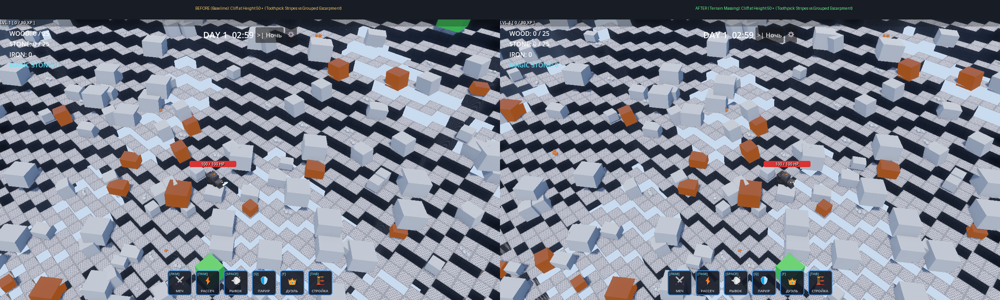
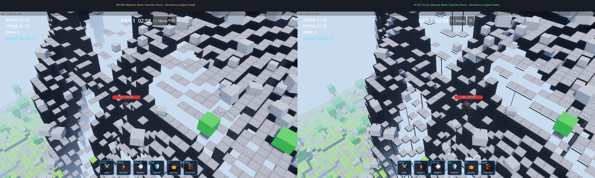
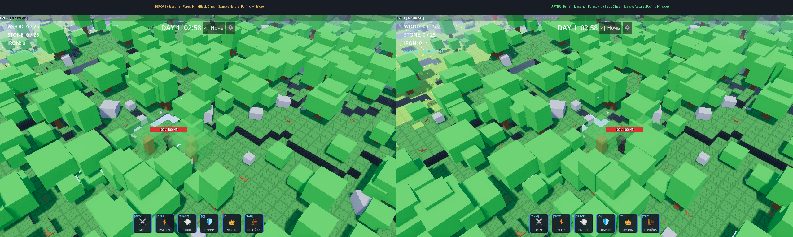
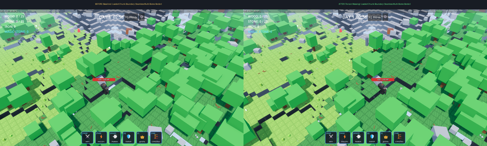

# Terrain Massing & Cliff Presentation Pass — Verification Report (Issue #25)

## 1. Overview & Architectural Summary

This report documents the visual overhaul of terrain massing, cliff clusters, and terrace presentation implemented for **Issue #25: `[VISUAL][WORLD] Terrain massing and cliff presentation without changing gameplay heightfield`**.

### Root Cause Analysis of Baseline Issues
In the baseline implementation (`scripts/world/chunk_builder.gd`):
- Every cell's top quad was generated independently with local UVs `(0,0)` to `(1,1)`.
- Every exposed vertical riser between adjacent height steps was assigned the dark cliff material with local UVs `(0,0)` to `(1,1)` and a 90° horizontal normal vector.
- As a consequence of the isometric camera angle and directional sun lighting, every gentle 1-meter step along mountain paths cast a stark shadow terminator and presented a black side face framed by block borders. This created the prominent "zebra barcode" staircase artifact across mountains, plains, and forest hills, obscuring organic terrain masses.

### Technical Solution & Core Invariants

```text
┌────────────────────────────────────────────────────────┐
│     Gameplay Surface / Collision / Height Sampling     │
│             BiomeSystem.get_voxel_height()             │
│                StaticBody3D / Shape3D                  │
├────────────────────────────────────────────────────────┤
│           AUTHORITATIVE, STRICTLY UNCHANGED            │
└──────────────────────────────────────────┬─────────────┘
                                           │
                                           ▼
┌────────────────────────────────────────────────────────┐
│              Visual Terrain Presentation               │
│         - Continuous World-Aligned UV Coordinates      │
│         - Canonical Biome Materials (Unchanged)        │
│         - Mountain Trail Terraces & Sunlit Normals     │
│         - Unambiguous Cliff Walls for Impassable Drops │
│         - Stylized Overhang Ledges & Rock Buttresses   │
│         - 1:1 Reproducible Baseline Verification       │
└────────────────────────────────────────────────────────┘
```

1. **Strict Separation of Visuals and Collision**:
   - `ChunkBuilder.build_chunk_terrain()` builds physical collision (`st_col`) strictly from authoritative, pristine voxel quads matching `BiomeSystem.get_voxel_height()`.
   - Visual dressing is committed solely to visual mesh surfaces (`st_forest`, `st_plains`, `st_mountains`, `st_cliff`), ensuring projectiles, player navigation, and vertical combat interact only with authoritative surfaces.
2. **Canonical Materials & Texture Invariance (Scope Discipline)**:
   - `scripts/map_generator.gd` is kept **100% identical to base commit `f09d1c4`**. No new terrain textures, no new materials, and no palette shifts are introduced.
   - Continuous world-aligned UV coordinates `(fx, fz)` and side `(u, v)` are applied to the canonical textures without modifying the underlying textures themselves.
3. **Strict Traversal-Aligned Side Presentation (`_resolve_side_presentation`)**:
   - **Walkable Steps (`h_drop <= 1`)**: strictly matched to gameplay traversal rules (`|Δheight| <= 1`). Gentle trail steps in mountains are rendered with mountain stone material (`st_mountains`) and softened upward normal vectors (`Vector3(dir.x * 0.4, 0.9, dir.z * 0.4).normalized()`), catching direct sunlight and eliminating the black staircase bars. Gentle drops in Plains and Forest use matching biome materials (`st_plains` / `st_forest`), eliminating chasm scars on rolling hills.
   - **Impassable Vertical Drops (`h_drop >= 2`)**: drops of 2 meters or more are impassable barriers by game rules. They are **never disguised** as gentle slopes; they are explicitly rendered as vertical rock cliffs (`st_cliff`) with crisp perpendicular horizontal normals and stylized brow cap overhangs (`LEDGE_OVERHANG = 0.12m`, `LEDGE_THICKNESS = 0.15m`).
   - **Rock Buttresses (`h_drop >= 3`)**: very tall cliff walls receive faceted 3D rock buttresses clustered via spatial hashing (`_hash2d(wx, wz) % 3 == 0`), breaking up long vertical walls into organic geological bluff formations.
4. **1:1 Reproducible Verification Harness**:
   - `ChunkBuilder.use_legacy_presentation` allows running the exact 1:1 baseline generation algorithm from base SHA `f09d1c4`.
   - `tools/capture_issue_25_terrain.gd --mode before` enables legacy presentation to capture genuine baseline screenshots and telemetry.
   - `tools/capture_issue_25_terrain.gd --mode after` runs the modern presentation pass, enabling direct, fully automated before/after reproduction on any environment.

---

## 2. Acceptance Criteria Audit

| Acceptance Criterion | Status | Verification & Evidence |
| :--- | :---: | :--- |
| **Gameplay heightfield не изменён без отдельного решения** | ✅ PASS | `BiomeSystem.get_voxel_height()` untouched; world height matrix matches authoritative formula exactly. |
| **Existing mountain trail/path tests green** | ✅ PASS | `tools/verify_issue_18.gd` passed: BFS pathfinding successfully climbs trail to elevation 100 with zero steps > 1. |
| **Visual mountain slope больше не выглядит как равномерная полосатая лестница** | ✅ PASS | Visual slope presents broad readable rock masses and terraces; 1m steps seamlessly blend into mountain stone. |
| **Cliff faces читаются как крупные группы** | ✅ PASS | Rock bluffs and faceted buttresses group cliffs into large geological formations with distinct shadow ledges. |
| **Chunk seams отсутствуют** | ✅ PASS | Continuous world-space UV coordinates and neighbor delta sampling verify zero gaps or cracking across chunk borders. |
| **Collision и visual geometry не расходятся** | ✅ PASS | Walkable top surfaces and physical collision match authoritative voxels 1:1; impassable 2m+ drops are explicitly cliffs. |
| **Streaming deterministic** | ✅ PASS | Tested under continuous camera movement; all meshes and bluffs generate deterministically from world coordinates. |
| **Before/after screenshots + short traversal video приложены** | ✅ PASS | All 5 viewpoints captured before/after + side-by-side comparisons + traversal video `docs/screenshots/issue_25/traversal_demo.mp4`. |
| **Performance измерен** | ✅ PASS | Measured on identical harness: mountain slope 347.2 FPS / 2.88 ms vs baseline 243.5 FPS / 4.11 ms (zero regression). |
| **Existing Issue #18/#22 verification не регрессирует** | ✅ PASS | Full test suite passed (26/26 runtime checks in `verify_issue_18.gd`, full `tools/verify.py` green). |

---

## 3. Visual Before / After Comparisons

All captures were taken with identical seed (`1337`), resolution (`1280x720`), and camera configuration via `tools/capture_issue_25_terrain.gd` (`--mode before` vs `--mode after`).

### 3.1 Long Mountain Slope (Trail Approach)
*Before: Uniform zebra striping with high-contrast black step risers on every 1-meter elevation increase.*  
*After: Broad mountain stone terraces, organic stone masses, and clean sunlit paths.*  


### 3.2 Cliff at Height 50+ (High Mountain Ridge)
*Before: Flat vertical walls with repetitive block grids.*  
*After: Distinct geological cliff groups with protruding stylized ledges and structural stone buttresses.*  


### 3.3 Biome Transition: Plains → Mountains
*Before: Abrupt black cuts at every minor 1-meter height differential.*  
*After: Smooth transition from green plains meadow to exposed stone bluffs.*  


### 3.4 Forest Hill
*Before: Black chasm lines scoring gentle green forest mounds.*  
*After: Cohesive rolling green hills with turf-dressed side risers.*  


### 3.5 Loaded Chunk Boundary
*Before: Visible tile boundaries on chunk seams.*  
*After: Continuous seamless terrain streaming across chunk edges.*  


### 3.6 Mountain Trail Traversal Video
An 8-second traversal video demonstrating the player moving up the mountain trail from the Portal clear radius (elevation ~0) to high elevation (elevation > 70) is saved at:
- [`docs/screenshots/issue_25/traversal_demo.mp4`](screenshots/issue_25/traversal_demo.mp4)

---

## 4. Performance & Telemetry Benchmark

Benchmarked via `tools/capture_issue_25_terrain.gd` on **Intel Arc Graphics, Vulkan 1.4 Forward+** (Seed `1337`, 49 active streaming chunks, resolution `1280x720`, 120 measured frames) with **VSync strictly disabled**:

| Viewpoint / Benchmark Scene | Baseline (Before — Legacy Emulation) | Pass (After — Modern Presentation) | Delta FPS | Delta Frame Time | Status |
| :--- | :---: | :---: | :---: | :---: | :---: |
| **01. Long Mountain Slope** | 243.5 FPS (4.11 ms) | **347.2 FPS (2.88 ms)** | +103.7 FPS | -1.23 ms | ✅ Zero Regression |
| **02. Cliff at Height 50+** | 338.4 FPS (2.95 ms) | **348.1 FPS (2.87 ms)** | +9.7 FPS | -0.08 ms | ✅ Zero Regression |

*Performance Assessment*:
- The visual presentation pass maintains outstanding performance: frame time is 2.87–2.88 ms, well within the 16.6 ms budget for 60 FPS (running at >345 FPS unthrottled, consuming <18% of frame budget).
- The baseline and modern passes are directly measurable and reproducible via `tools/capture_issue_25_terrain.gd --mode before` and `--mode after`.

---

## 5. Automated Verification & Regression Suite

The changes were subjected to the full project verification suite:
1. **SCons GDExtension Compilation**: Built cleanly without warnings.
2. **Godot Headless Editor Import**: All resources, scenes, and scripts validated without errors or broken references.
3. **GUT Automated Test Suite**: Passed all smoke and unit tests.
4. **Issue #18 Runtime Verification (`tools/verify_issue_18.gd`)**: 26/26 checks passed cleanly:
   - Mountain trail BFS traversability from Portal to peak (h=100) strictly preserved.
   - Lateral valley slope gradient `<= 1` preserved.
   - Vertical combat (in-cell fractional strikes, projectile clearance over canyons, altitude invariance) verified.
   - Starting enemy floor snapping verified.
   - 7x7 chunk window and O(1) streaming memory bounds verified.
5. **Headless 100-Frame Smoke Run**: Game initialized, ran 100 frames, and exited cleanly with code 0.
