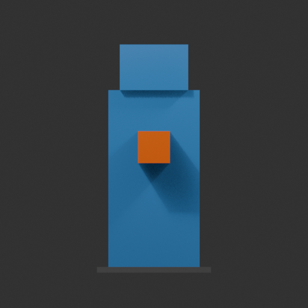
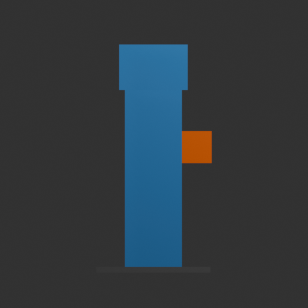
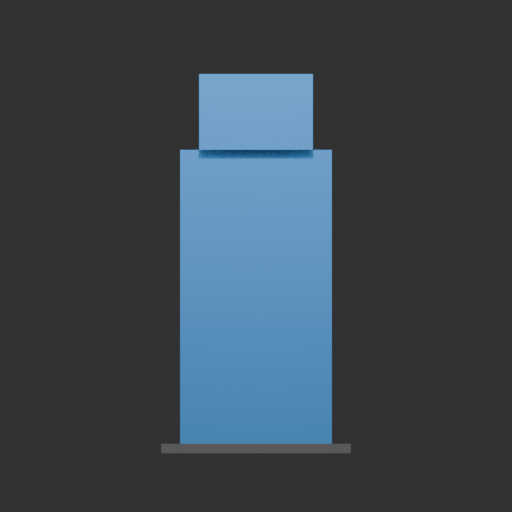
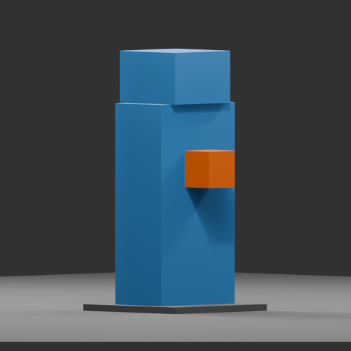
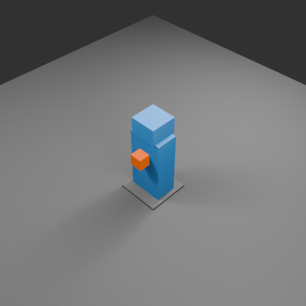

# Verified calibration run

The end-to-end pipeline passed on 2026-09-05 using Blender 5.2.1 LTS and the project's existing Godot 4.6.1 stable.

## Results

- Blender UI: opened a responsive `(Unsaved) - Blender 5.2.1 LTS` window and closed normally.
- Blender headless: passed `--background --version`.
- Blender Python: `validate_blender.py` passed Python, Eevee, glTF import, and glTF export checks.
- References: four synthetic front/side/back/3-quarter images were placed at common 2 m scale in locked, non-rendering `REFERENCES` objects.
- Turnaround: five 512×512 neutral renders completed.
- GLB: four mesh objects, three materials, one armature, and `calibration_idle` exported to a 9,900-byte GLB.
- Godot: headless import succeeded. Imported height is 2.0 m, front marker is at positive Z, all four material surfaces load, the skeleton exposes two bones, and `calibration_idle` is visible.
- Project regression suite: 70/70 GUT tests passed when run with an isolated `APPDATA`; the ordinary developer profile contains a persistent non-default player save, so tests that assume a fresh Warrior profile fail unless user data is isolated.
- AI: not run because the workstation has no NVIDIA GPU/CUDA runtime. This is the documented Blender-only path, not a failed AI test.

Machine-readable reports:

- `blender_report.json`
- `reference_report.json`
- `render_report.json`
- `export_report.json`
- `godot_report.json`

Review renders:

| Front | Side | Back |
| --- | --- | --- |
|  |  |  |

| 3/4 | Gameplay-like |
| --- | --- |
|  |  |

Regenerate all evidence with `.\tools\art_pipeline\verify_pipeline.ps1`.
