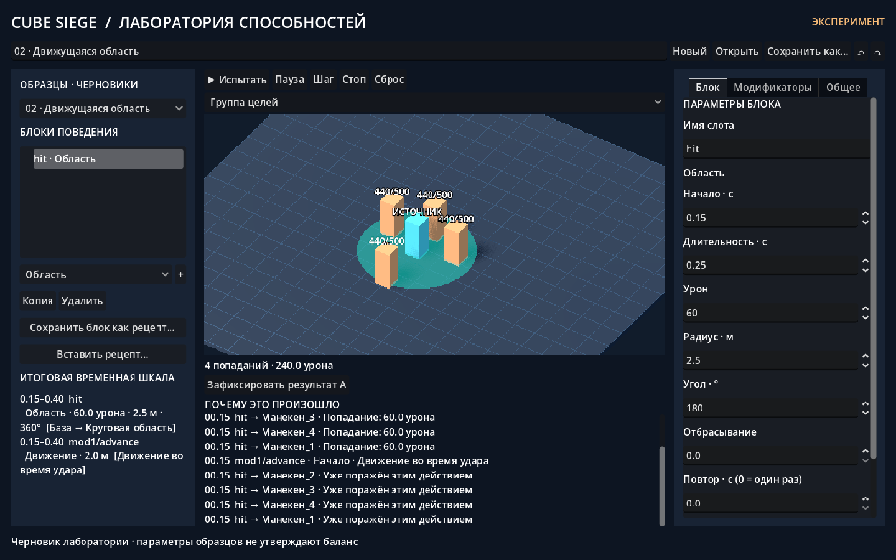

# Проверка лаборатории способностей

Дата: 2026-10-01, Asia/Tomsk. Godot 4.6.1 stable, Windows, Vulkan Forward+,
Intel Arc. Рабочая ветка: `codex/ability-laboratory`, исходный коммит `722bac4`.

## Фактически выполнено

| Проверка | Результат |
| --- | --- |
| `python tools/verify.py` | PASS всех 9 этапов; подробности в `verify.log` |
| GDExtension debug build | PASS |
| Headless-импорт | PASS |
| GUT | 308/308, 51 скрипт |
| Python unit tests | 135/135, 4 файла |
| Мир, вертикальный бой, стриминг | 26/26 |
| Главное меню | PASS, 60 кадров |
| Игровой smoke, 3 класса | 24/24 |
| Новые GUT-наборы отдельно | 18/18, 67 assertions; `ability-tests.log` |
| `python tools/run_ability_lab.py --smoke` | PASS |
| `python tools/run_ability_lab.py --capture` | PASS, кадр открыт и просмотрен |
| `git diff --cached --check` | PASS |

## Среда сборки

Первый холодный запуск достиг лимита 600 секунд при архивации godot-cpp.
Повтор был остановлен после диагностики: Windows-обработчик длинной команды
в неизменённом `godot-cpp/tools/my_spawn.py` вызывает `ar` отдельно для каждого
объектного файла. Для успешного полного аудита использована локальная настройка
SCons `custom_tools=.review_loop/scons_tools`, передающая аргументы `ar` через
response file с нормализованными `/` в путях. Одна промежуточная попытка с
ненормализованными путями завершилась ошибкой и не учитывается как PASS.

Исправленная локальная настройка меняла только форму вызова архиватора:

```python
from SCons.Subst import quote_spaces
env["TEMPFILEARGESCFUNC"] = lambda arg: quote_spaces(arg.replace("\\", "/"))
env["ARCOM"] = '${TEMPFILE("$AR $ARFLAGS $TARGET $SOURCES", "$ARCOMSTR")}'
```

Исходники C++, submodule и SConstruct не изменялись. Последующая проверка
стандартного SCons без override (`--dry-run`) подтвердила, что библиотека и DLL
актуальны. Настройка временная, в продукт и конфигурацию проекта не входит.

В тестовом журнале остаётся существующее предупреждение legacy-материала
`Godot 3.x SpatialMaterial remapped parameter not found: specular`, возникающее
при загрузке ресурсов игрока. Проверка лаборатории и её закрытия проходит без
новых script/runtime errors и утечек её ресурсов.

## Визуальное подтверждение



`overview.png` — кадр самого Godot, сценарий «Группа целей», второй образец,
14 шагов физики после запуска, пауза. Видны четыре попадания, суммарный урон 240,
параметры исходного блока и преобразованная сборка. Это тестовые параметры,
не утверждение баланса. Отдельного утверждённого художественного макета нет;
исходный референс — текстовая идея пользователя и согласованный первый срез.

Ограничения и дальнейшие возможности перечислены в [инструкции](../../ABILITY_LAB.md).
Внешнее PR-review этим отчётом не заменяется.
