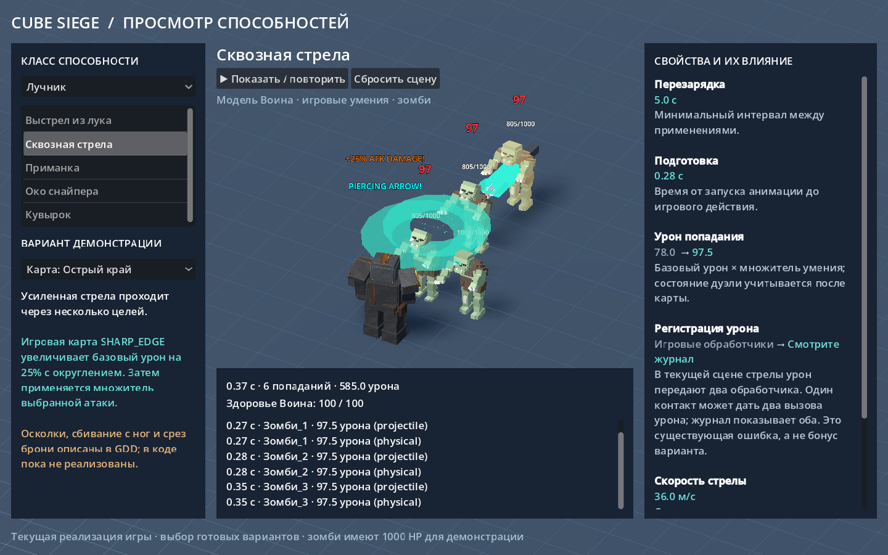
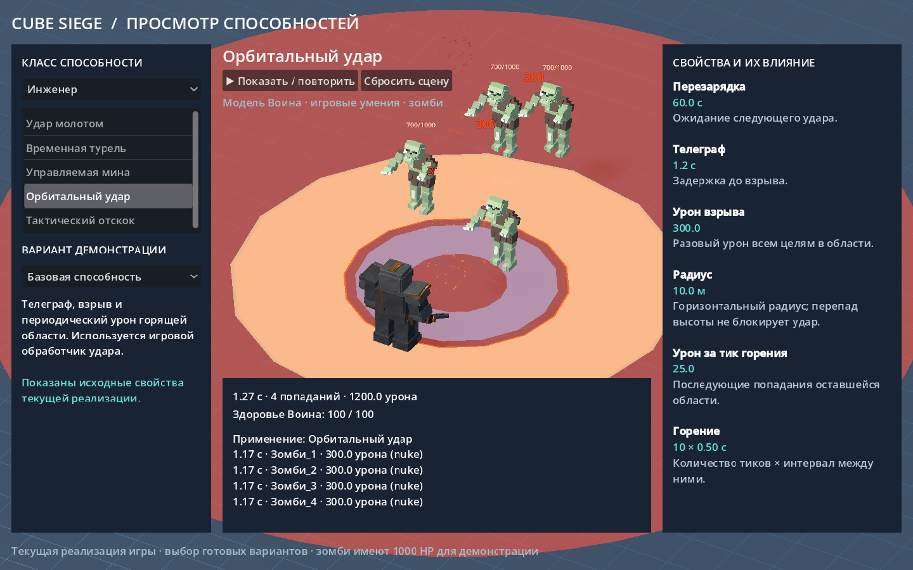

# Проверка просмотрщика способностей — PR #50, run 1

2026-10-01. Windows, Godot 4.6.1 stable, Vulkan Forward+, Intel Arc.
Ветка `codex/ability-laboratory`. Контракт — уточнённый прямой запрос пользователя:
только просмотр реальных способностей классов, свойств и их влияния; модель
Воина для любого умения и игровые зомби вместо геометрических заглушек.

## Фактически выполнено

| Проверка | Результат |
| --- | --- |
| `python tools/verify.py` | PASS всех 9 этапов; `verify.log` |
| GDExtension debug build, штатный SCons | PASS |
| Headless-импорт | PASS, без script/parse errors; оговорка о MCP ниже |
| Полный GUT | 301/301, 50 скриптов |
| Python unit tests | 135/135, 4 файла |
| Мир, вертикальный бой, стриминг | 26/26 |
| Главное меню | PASS, 60 кадров |
| Игровой smoke, 3 класса | 24/24 |
| Новый набор отдельно | 11/11, 156 assertions; `ability-tests.log` |
| Три конечных рендера | PASS, изображения открыты и просмотрены |
| Runtime рендеров и нового GUT-набора | Без script/runtime errors и сообщений об утечках |

В новом наборе проверены все 15 записей, игровые классы при неизменной модели
Воина, сцены и анимации зомби, доступность свойств, отсутствие редактора,
настоящие попадания меча, молота и стрел, карты, парирование, дуэль, приманка,
турель, мина, орбитальный удар, рывки и сброс отложенных действий.

Базовый `player_prototype.gd` возвращён к исходному состоянию PR: альтернативного
слота способности нет. Отдельный тест публичных `perform_attack()` и
`perform_special_attack()` подтверждает, что спецатака на перезарядке сохраняет
ожидающую обычную атаку при несовпадающем направлении корпуса и прицела.

## Замечания run 1 и смена контракта

- **B1:** потеря модификаторов была воспроизведена исходными тестами редактора.
  После уточнения пользователя редактор, операции сохранения/вставки рецептов
  и отдельный формат созданных умений удалены. Новый тест проверяет отсутствие
  этих операций и редактируемых полей. Импорт рецептов больше не обещается.
- **B2:** ручной вызов физики из кнопки удалён вместе с экспериментальным
  исполнителем. Просмотр запускает нативные действия и физику Godot в реальном
  времени; кнопки ручного шага нет. Её отсутствие проверяется тестом.
- **B3:** потеря ожидающей атаки была воспроизведена на прежнем спецслоте.
  Спецслот удалён; сохранность буфера стандартного игрока проверена тестом.

Эти пункты устранены в соответствии с новым контрактом просмотра, а не заявлены
как завершённый редактор. Слияние и внешнее approval не выполнялись.

## Диагностика и границы

Первоначальные ожидания о единичном уроне стрелы и обязательном лечении
вампиризмом не совпали с существующим игровым кодом. Разбор подтвердил два
обработчика урона стрелы и раннюю проверку вампиризма. Тесты просмотрщика
проверяют фактические вызовы, значения карт и здоровье; эти дефекты явно
подписаны в интерфейсе и [инструкции](../../ABILITY_LAB.md). Боевые правила
просмотрщик не исправляет и не компенсирует.

Сброс отсоединяет старую сцену сразу, но удерживает её до завершения коротких
нативных async-callbacks. Это устранило воспроизведённую утечку SceneTreeTimer
при сбросе во время способности. Таймеры ауры парирования и метки дуэли теперь
принадлежат соответствующему эффекту и удаляются вместе с ним.

Отдельная проверка закрытия headless-редактора завершается с кодом 0, но
показывает `10 resources still in use at exit` (`editor-import.log`). Verbose
диагностика относит все десять ресурсов к неизменённому `addons/godot_mcp/`
(mcp_server_core, config_manager, tool_policy, tool_definition, tool_registry,
tool_executor, debug_tools_native, tool_state_manager, mcp_tool_classifier).
У сцены просмотра, конечных рендеров и нового тестового набора этого сообщения
нет. Поэтому PASS штатного импорта не заявляется как полностью чистое закрытие
самого редактора с установленным MCP-плагином.

## Проверенные кадры

Использованы существующие модели проекта по прямому запросу пользователя;
отдельный художественный макет не создавался. Все изображения сняты в Godot.

`--capture --entry 1 --delay 0.3`: карта «Острый край», два попадания по 75.

`--capture --entry 6 --delay 0.4`: тот же Воин, настоящий снаряд и события
обоих существующих обработчиков урона; ограничение подписано справа.

`--capture --entry 13 --delay 1.3`: четыре попадания по 300, параметры взрыва
и горения. Временные метки журнала измеряются по физическим кадрам и могут
отличаться на несколько кадров от idle-таймеров нативных способностей.
