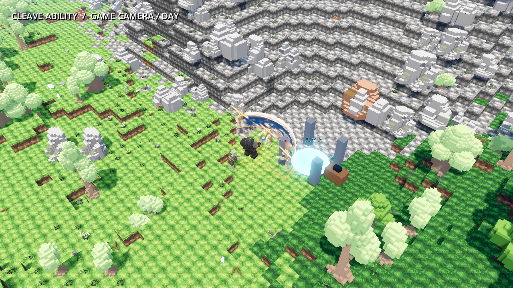
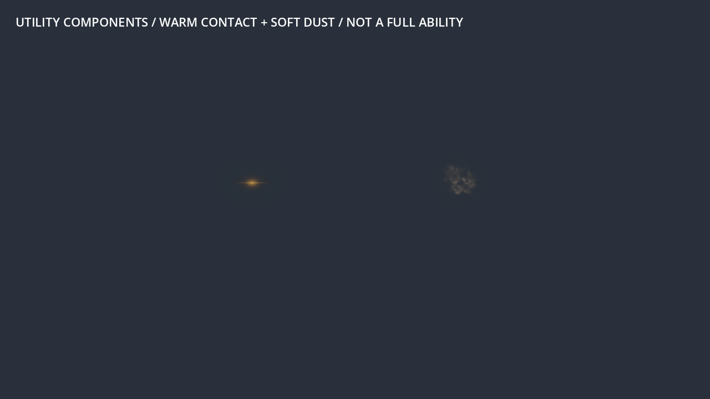

# VFX Workbench verification

Local implementation on top of `0d590881a3e72a9084467ac484311469e6decbb3`.
The approved warrior cleave, its gameplay spec, body animation and runtime
presentation are unchanged. This work improves discovery, trials, recording,
evidence checks and source-asset handoff. No push/PR was performed.

## Entry point and retained result

[Start here](../../vfx/START_HERE.md) gives the short workflow and small-model
task wording. [Library](../../vfx/LIBRARY.md) identifies existing production
components, two optional one-shot accents, six local CC0 masks and primary sources.
[Asset-factory handoff](../../vfx/GAME_ASSETS.md) documents the actual upstream
quality protocol and package boundary.

Representative screenshots are retained here; complete local evidence packages
with movies, source/file SHA256, commands, conditions and runtime logs remain in
ignored `screenshots_debug/vfx_workbench/`. `index.html` presents the ordered frames
and motion without a separate Python image dependency. Recorded motion clips are
available, but this pass's visual observations are based on opened phase PNGs;
sound quality and full-sequence playback were not newly audited.

## Actual checks

- `python tools/vfx_workbench.py doctor`: PASS. A bounded editor import precedes
  real bindings inspection. Three player and three enemy models have forward-dot
  agreement 1.0 with actor -Z. Imported forward is a known declaration checked
  against wrappers, not automatically inferred anatomy. Joint rotations are
  current presentation snapshots, not claimed canonical bone-rest values.
- `init workbench_probe --family mine`: PASS; copied preset bytes matched the
  actual production resource, TODO brief identified a proposal. The owned probe
  profile was removed after the check; it is not a new production asset.
- Final `capture cleave --case day --case basic --case miss --profile
  assets/vfx/cleave/sovereign_edge.tres`: PASS all three processes. Day:
  damage_pass=true, release=1, contacts=3; basic: damage_pass=true,
  cleave releases/contacts=0; miss: release=1, contacts=0. All settle with zero
  active effects, zero camera offsets and an empty trail. Cases retained in
  `cleave_final_01`; normal camera, seed 1337, 1280×720, offline 60 FPS, Godot 4.6.1
  Forward+, Intel Arc. Opened day22/25/29/65, basic9/22 and miss29/65 PNGs.
- Final `capture stamps`: PASS (`stamps_final_04`), active_effects=0 after 90
  fixed-step frames. Preview views demonstrate a small warm flash followed by
  a lighter expanded/rising dust patch, then disappearance. Earlier inspection
  caught ordinary billboard discarding scale; `billboard_keep_scale=true`
  fixes the advertised size controls. Dust tint and diagnostic camera were
  adjusted because the first preview was too faint. These remain initial
  subordinate accents requiring production-context tuning, not approved
  complete effects or production hit feedback.
- `capture mine --case day --profile assets/vfx/mine/trials/luna_clear.tres`:
  PASS actual detonation, damage boundary and cleanup (`mine_luna_01`).
- `capture archer --case surface`: PASS actual wall/miss harness
  (`archer_surface_01`), 3 wall contacts, 0 fabricated miss impacts, active=0.
- `capture sword --case rapid --profile assets/vfx/sword/trials/luna_soft.tres`:
  PASS after correcting an existing harness oracle (`sword_luna_02`), contacts 32,
  health 8912, active 0, blade endpoint error ≈0.00000055 m, settled trail 0.
  The first capture correctly failed because the old harness assumed fixed 25
  damage while the production player's progression produced actual 34.
  The assertion now consumes actual `attack_damage`; gameplay was not changed.
  Luna trial renders demonstrate the working proposal→capture path, not an
  artistic improvement or selection of those trials as defaults. Their broader
  coverage and a controlled visual comparison remain unreviewed here.
- Freshness checker correctly rejects earlier captures after source changes
  and reports `CURRENT AND INTACT` for `stamps_final_04`. An unfilled
  art-review file remains incomplete. Explicit observations/skip reasons can
  be recorded after inspection; this is not an automatic beauty score.

The final utility capture at 2026-09-30 09:26:43 UTC has source fingerprint
`154d5f4a19341c042bf89f31e4ee5f8030d616f3b6beebf2f32ada167efa8a1c`.
The successful cleave and earlier utility captures had fingerprint
`93baf299d0627caad89213ac8ab1fbce583acb0e293ec4e5f82934641e82aed6`
and were current when checked. A final tool-only correction added imported
JPEG/WebP/Ogg binary inputs to the fingerprint; those older packages now
correctly report stale. Gameplay/preset content and their observed images did
not change. Only the utility case was recaptured after this correction.
It covers project/source/harness content and `.import` settings with normalized
text newlines. It excludes engine/native binary hashes, external dependencies,
hardware and save state. Godot version is separately retained and checked.
Captures used the production world's existing progression; harness damage
expectations consume the actual live values.

## Tests and asset-factory interoperability

`python tools/verify.py`: PASS all stages — build, editor import, **305 GUT
tests across 51 scripts, 147 Python tests, 26 world/combat/streaming checks,
menu smoke and 24 gameplay checks**. Three new GUT tests exercise independent
per-instance materials, retained billboard scale, target following/removal and
delta-clock cleanup. Thirteen targeted Python tests exercise real CLI dispatch,
asset hashes/catalog, finite timeout/error handling, stale/tampered/incomplete
evidence, declared-contained exports, overwrite refusal, retained failure
diagnostics and external-URI GLB rejection. Final 13/13 Python tests passed
after the JPEG/WebP/Ogg fingerprint correction, including a binary-byte and
GLTF newline regression. Final successful sword rendering
checked the last harness-oracle adjustment after the full audit's import.

The actual `game_assets` checkout was inspected read-only: **zero type=vfx
packages currently**, and its existing dirty review-loop/entrypoint files were
preserved. A disposable factory fixture using its real `quality_gate.py` was
built from an unchanged local Kenney CC0 source. Build/check/verify-clean PASS;
candidate import preserved exact image SHA256, original License.txt, upstream
quality snapshots and candidate status. Runtime-reviewed delivery was correctly
refused without a recorded current visual review. This proves schema/protocol
interoperability, not creation or approval of a new factory VFX package.

The stock skill validator passed. The narrow Workbench routing paragraph in
repository `vfx-craft/SKILL.md` was synchronized to the existing personal skill
after checking it matched the previous revision; other installed files were
preserved. Source links/CC0 license were checked against primary sources on
2026-09-30. No new runtime dependency or package-manager install is required.

## Remaining limits

Workbench provides five known families and honest coverage limits; it is not
a universal auto-authoring engine. New ability mechanics still need a real
entry-point adapter and task-specific geometry/event tests. This iteration
did not re-audit every night/crowd/pose/performance case, moving casters,
interrupted-cast movies, a hardware matrix or real-time stress for optional
accents. Existing cleave evidence remains available independently.
Neither Flash/Luna nor another agent was newly run end-to-end to author a
whole ability using these instructions; existing Luna profiles exercised the
actual capture path. No guarantee of ideal VFX quality is made.
